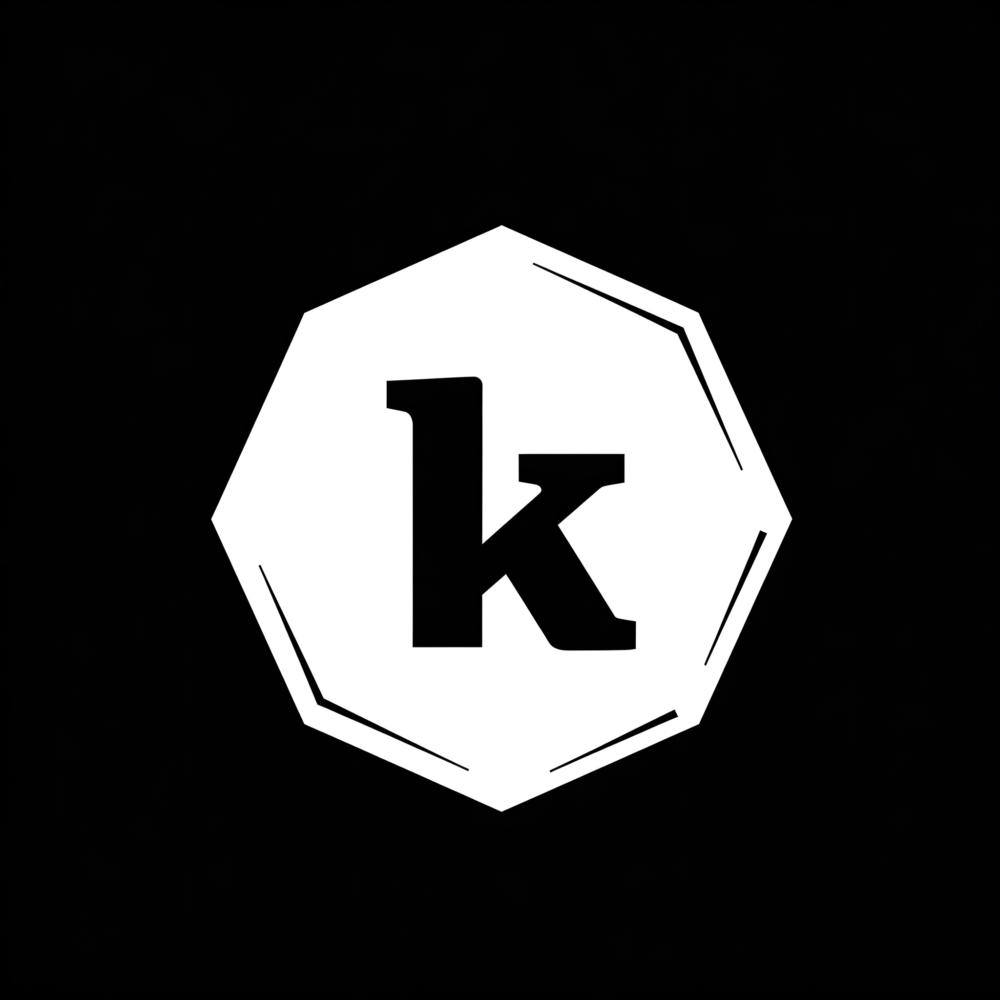

# Kommodity

[](https://goreportcard.com/report/github.com/kommodity-io/kommodity)
[](https://pkg.go.dev/github.com/kommodity-io/kommodity)
[](https://github.com/kommodity-io/kommodity/actions)
[](https://github.com/kommodity-io/kommodity/releases)
[](https://github.com/kommodity-io/kommodity/blob/main/LICENSE)

Kommodity is an open-source infrastructure platform to commoditize compute, storage, and networking.

> 🚧 EXPERIMENTAL 🚧: This project is in an early stage of development and is not yet ready for production use. APIs may break between minor releases, and the project is not yet feature-complete. The project does however adhere to [semantic versioning][semver], so patch releases will never break the API.

## Development

Make sure to have a recent version of Go installed. We recommend using [gvm][gvm] to install Go.

```bash
gvm install go1.24.2 -B
gvm use go1.24.2 --default
```

As a build system, we use `make`.

```bash
# Create a binary in the `bin/` directory.
make build
# Run code generation and start the local development setup (through docker compose)
make setup
# Run the application locally.
make run
# Teardown the local development setup
make teardown
```

### ⚠️ Dependencies

If you want to run Kommodity with authentication using OpenID Connect (OIDC), you need to have `kubectl` `oidc-login` plugin installed. We recommend that you install it via [`krew`](https://krew.sigs.k8s.io/docs/user-guide/setup/install/).

```bash
kubectl krew install oidc-login
```

Example of `kommodity.yaml` kubeconfig file with OIDC authentication:

```yaml
apiVersion: v1
kind: Config
clusters:
  - name: kommodity
    cluster:
      server: http://localhost:8000
users:
  - name: oidc
    user:
      exec:
        apiVersion: client.authentication.k8s.io/v1
        command: kubectl
        args:
          - oidc-login
          - get-token
          - --oidc-issuer-url=ISSUER_URL
          - --oidc-client-id=YOUR_CLIENT_ID
          - --oidc-extra-scope=email
          - --oidc-extra-scope=profile
contexts:
  - name: kommodity-context
    context:
      cluster: kommodity
      user: oidc
current-context: kommodity-context
preferences: {}
```

## Demo

```bash
# Test the application via `kubectl`.
kubectl --kubeconfig kommodity.yaml api-versions
kubectl --kubeconfig kommodity.yaml api-resources
kubectl --kubeconfig kommodity.yaml create -f examples/namespace.yaml
kubectl --kubeconfig kommodity.yaml create -f examples/secret.yaml
# Test gRPC reflection.
grpcurl -plaintext localhost:8000 list
```

## Features

### 🔒 OIDC Authentication

Kommodity supports authentication using OpenID Connect (OIDC), allowing integration with modern identity providers such as Google, or Azure AD. By leveraging OIDC, Kommodity enables secure, standards-based authentication for API requests.

This feature ensures that only authorized users—those in the configured admin group or the Kubernetes `system:masters` group—can perform privileged operations. When authentication is disabled (`KOMMODITY_INSECURE_DISABLE_AUTHENTICATION=true`), all requests are allowed by default for easier local development and testing.

### 🗄️ Storage

Storage of Kubernetes resource objects is done in a PostgreSQL database. We chose PostgreSQL because it is widely available as a managed service on virtually every cloud provider, making it easy to deploy and operate Kommodity in any environment.

This approach leverages [Kine](https://github.com/k3s-io/kine) to translate Kubernetes API storage operations into PostgreSQL queries, ensuring compatibility and reliability.

### 🧩 Providers Configuration

Kommodity is designed to be extensible and support multiple providers. The list of supported providers is managed in the [`providers.yaml`](pkg/provider/providers.yaml) file. Each entry specifies the provider name, repository, relevant Go module, and the YAML file containing the provider’s CustomResourceDefinitions (CRDs).

For each provider, you can:

- **Specify CRD filters:** Use the `filter` field to select only the CRDs you need for your deployment.
- **Exclude unwanted CRDs:** Add CRD kinds to the `deny_list` to prevent them from being installed.
- **Define API scheme locations:** The `scheme_locations` field lists the API versions and groups to include for each provider.

This flexible configuration allows you to streamline your setup and avoid installing unnecessary resources.

> **ℹ️ Note:** Providers need to be compatible with version `1.10.4` of Cluster API.

### Mock KMS Service

The `kms` package provides a mock implementation of the [Talos Linux Key Management Service (KMS)][talos-kms-api]. This implementation:

- Exposes SideroLabs KMS API via gRPC.
- Includes mock `Seal` and `Unseal` methods.

`Seal` prepends the string `sealed:` to the input data.

```bash
# Test sealing.
export SECRET="This is super secret"
grpcurl -plaintext -d "{\"data\": \"$(echo -n "$SECRET" | base64)\"}" \
  localhost:8080 sidero.kms.KMSService/Seal \
  | jq -r '.data' | base64 --decode
```

`Unseal` removes the `sealed:` prefix from the input data.

```bash
# Test unsealing.
export SEALED="sealed:This is super secret"
grpcurl -plaintext -d "{\"data\": \"$(echo -n "$SEALED" | base64)\"}" \
  localhost:8080 sidero.kms.KMSService/Unseal \
  | jq -r '.data' | base64 --decode
```

## 🔧 Configuration

Several environment variables can be set to configure Kommodity:

| Environment Variable        | Description                                              | Default Value        |
|-----------------------------|----------------------------------------------------------|----------------------|
| `KOMMODITY_PORT`            | Port for the Kommodity server                            | `8000`               |
| `KOMMODITY_ADMIN_GROUP`     | Name of the admin group for privileged access            | (none)               |
| `KOMMODITY_INSECURE_DISABLE_AUTHENTICATION` | Disable authentication for local development         | `false`  |
| `KOMMODITY_OIDC_ISSUER_URL` | OIDC issuer URL for authentication                       | (none)               |
| `KOMMODITY_OIDC_CLIENT_ID`  | OIDC client ID for authentication                        | (none)               |
| `KOMMODITY_OIDC_USERNAME_CLAIM` | OIDC claim used for username                         | `email`              |
| `KOMMODITY_OIDC_GROUPS_CLAIM`  | OIDC claim used for groups                            | `groups`             |
| `KOMMODITY_DB_URI`          | URI of the PostgreSQL database                           | (none)               |
| `KOMMODITY_KINE_URI`        | URI of the Kine database                                 | (none)               |

## License

Kommodity is licensed under the [Apache License 2.0](LICENSE).

[gvm]: https://github.com/moovweb/gvm
[talos-kms-api]: https://github.com/siderolabs/kms-client/blob/main/api/kms/kms.proto
[semver]: https://semver.org
