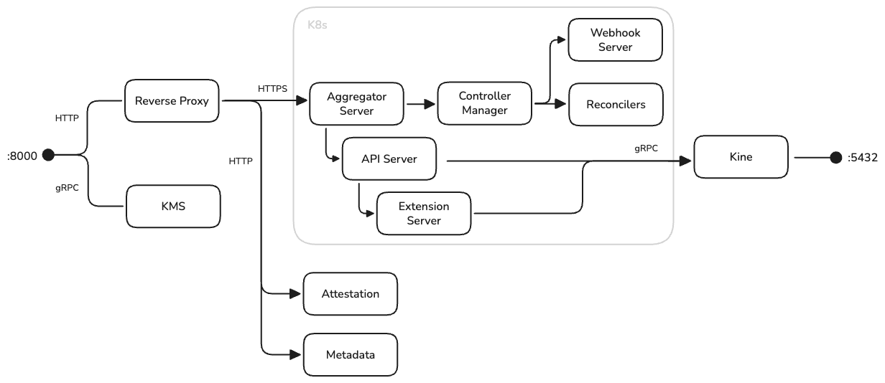
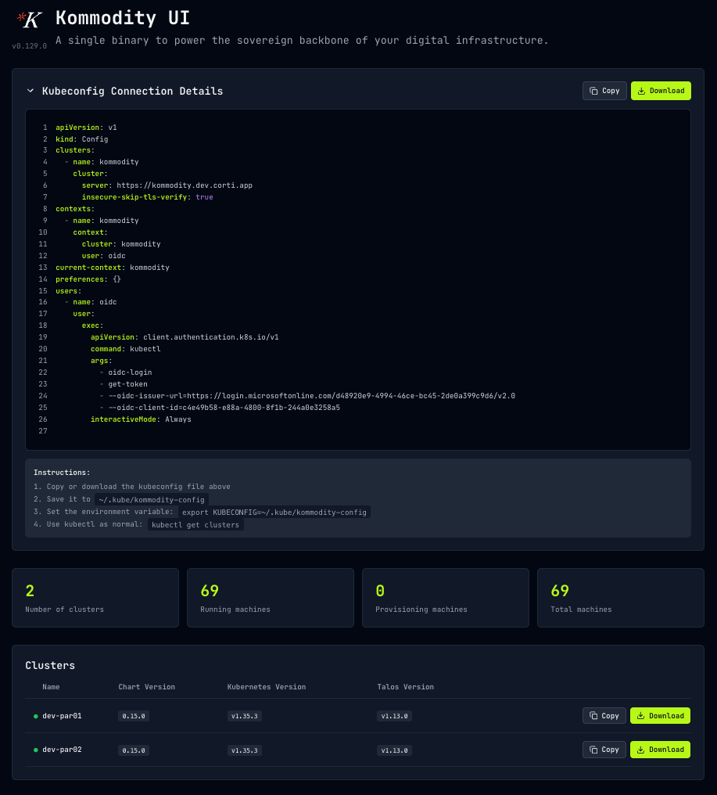
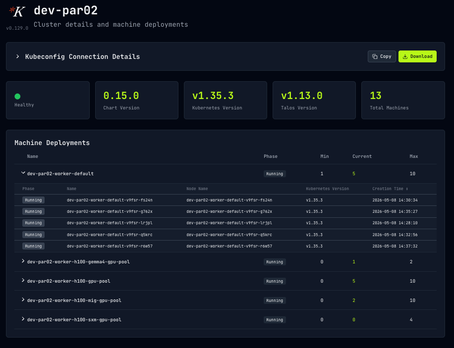

<p align="center">
  <a href="https://goreportcard.com/report/github.com/kommodity-io/kommodity"></a>
  <a href="https://pkg.go.dev/github.com/kommodity-io/kommodity"></a>
  <a href="https://github.com/kommodity-io/kommodity/actions"></a>
  <a href="https://github.com/kommodity-io/kommodity/releases"></a>
  <a href="https://github.com/kommodity-io/kommodity/blob/main/LICENSE"></a>
</p>

> **One binary. Kubernetes APIs. Verifiable machines. Encrypted disks.**
>
> Kommodity packages Cluster API, Talos Linux providers, and hardware-rooted
> security services into a single binary so that compliant, multi-cloud
> Kubernetes clusters are as routine to deploy as any other workload.

---

## Table of Contents

- [Why Kommodity](#why-kommodity)
- [What's in the Box](#whats-in-the-box)
- [Architecture](#architecture)
- [Features](#features)
- [Quick Start](#quick-start)
- [Deployment](#deployment)
- [Configuration](#configuration)
- [CAPI Provider Versions](#capi-provider-versions)
- [Further Reading](#further-reading)
- [License](#license)

---

## Why Kommodity

Sovereign cloud — keeping control of your infrastructure, your encryption keys,
and your audit trail — usually means stitching together cloud-specific tooling,
bespoke key management, and ad-hoc attestation. The result is fragile, expensive,
and locked to whoever sold you "sovereign" first.

Kommodity takes the opposite approach: assemble proven, open-source building
blocks (Cluster API, Talos Linux, Kine, TPM attestation) and ship them as a
single binary that speaks the Kubernetes API. The same `kubectl` and Helm
workflows work across Scaleway, Azure, KubeVirt, Docker, and bare metal.

| Without Kommodity                            | With Kommodity                                          |
| -------------------------------------------- | ------------------------------------------------------- |
| Learn each cloud's APIs, consoles, and quirks | One Kubernetes-native control plane for every provider  |
| Trust machines because they're "on the network" | TPM-attested boot — no quote, no secrets                 |
| Cloud-provider KMS holds the encryption keys | Per-volume LUKS keys live in your database               |
| Different ops model per environment          | Same GitOps, RBAC, and audit logs everywhere             |
| Compliance bolted on after deployment        | Encryption, attestation, and audit logging by default    |

---

## What's in the Box

A single `kommodity` binary that combines:

- **Kubernetes API server** — built on `k8s.io/apiserver` with extension and aggregation layer support
- **Cluster API controllers** — cluster, machine, and machine-deployment lifecycle
- **Talos Linux providers** — bootstrap and control-plane providers for immutable nodes
- **[Kine](https://github.com/k3s-io/kine)** — etcd shim that lets any [supported SQL backend](https://deepwiki.com/k3s-io/kine#backend-driver-architecture) (PostgreSQL, MySQL, SQLite, NATS, …) replace etcd
- **KMS service** — networked LUKS2 key management with per-volume AES-256-GCM and AAD binding
- **Attestation service** — TPM 2.0 quote verification gated by per-cluster policy
- **Metadata service** — Talos machine config delivery, gated by attestation
- **Talos proxy** — HTTP CONNECT proxy that tunnels gRPC into private-network workload clusters
- **Cluster autoscaler integration** — scales `MachineDeployment` replicas based on pending pods
- **Web UI** — kubeconfig retrieval, cluster overview, machine deployment drill-down

---

## Architecture



For the security architecture — TPM attestation flow and disk encryption key
management — see [SECURITY.md](SECURITY.md).

---

## Features

### One API, Any Cloud

Provision Kubernetes clusters with vanilla Cluster API resources. Today
Kommodity ships with providers for Scaleway, Azure, KubeVirt, and Docker; CAPI's
provider ecosystem means more can be added without touching Kommodity itself.

### OIDC Authentication

Plug Kommodity into Google, Azure AD, or any other OpenID Connect provider.
Group claims from the IdP map to authorization decisions; the
`KOMMODITY_ADMIN_GROUP` you configure gets cluster-admin equivalence, alongside
the standard `system:masters`. For local development, set
`KOMMODITY_INSECURE_DISABLE_AUTHENTICATION=true`.

### Audit Logging

Native support for the Kubernetes
[audit policy format](https://kubernetes.io/docs/tasks/debug/debug-cluster/audit/).
Point `KOMMODITY_AUDIT_POLICY_FILE_PATH` at a policy file and every API request
is captured with user, source IP, timestamp, and (optionally) request/response
bodies.

### Hardware-Rooted Machine Trust

The [attestation extension](https://github.com/kommodity-io/kommodity-attestation-extension)
runs on every Talos node and submits a TPM-signed quote — covering Secure Boot,
SELinux/AppArmor state, kernel lockdown, installed extensions, and PCR values —
before the metadata service is willing to hand over machine configuration. A
machine that can't prove what it booted gets no secrets.

### Sovereign Disk Encryption

The KMS service implements the SideroLabs
[KMS gRPC API](https://github.com/siderolabs/kms-client) and seals LUKS2 keys
for the `STATE` and `EPHEMERAL` partitions with AES-256-GCM. Each volume gets
its own key and AAD nonce; the AAD binds the ciphertext to the node UUID and
the requesting IP, so a leaked disk image is unreadable on its own. Key
revocation is `kubectl delete secret`.

### Talos Proxy

When the management plane manages clusters on private networks, the
TalosControlPlane reconciler cannot reach Talos nodes directly on port 50000.
A local HTTP CONNECT proxy intercepts those gRPC connections and tunnels them
through a Kubernetes port-forward to a `talos-cluster-proxy` pod inside the
workload cluster. End-to-end mTLS is preserved. See
[`pkg/talosproxy`](pkg/talosproxy/README.md) for details.

### Auto-Bootstrap

The [auto-bootstrap extension](https://github.com/kommodity-io/kommodity-autobootstrap-extension)
turns control-plane bring-up into a no-touch operation: every candidate node
runs the same deterministic leader-election algorithm (earliest boot time,
lowest IP as tiebreaker) over peers discovered in the configured CIDR, the
winner initializes etcd, and the rest join automatically. Private networks
only.

### Autoscaling

A cluster-autoscaler-compatible reconciler watches `MachineDeployment` replica
counts and requeues until they converge, so the upstream cluster autoscaler can
drive replicas the same way it would on any CAPI-managed cluster.

### Web UI

The UI exposes the bits operators actually need without making them touch
`kubectl`: per-cluster kubeconfig copy/download, an at-a-glance dashboard of
clusters and machine counts, and a cluster detail page with machine-deployment
breakdowns (including GPU pools) and health status. With Kommodity running, the
overview is at [`/ui`](http://localhost:8000/ui) and the per-cluster page at
[`/ui/clusters/<cluster-name>`](http://localhost:8000/ui/clusters/).

**Overview** — kubeconfig retrieval, cluster counts, and the clusters table:



**Cluster details** — health, versions, and per-cluster machine deployments
with min/current/max replicas:



### Storage Backends

Kommodity uses Kine, so any database
[supported by Kine](https://deepwiki.com/k3s-io/kine#backend-driver-architecture)
can back the API server. PostgreSQL is the default and best-tested.

### Cluster Addons

The [`kommodity-cluster`](charts/kommodity-cluster) Helm chart ships with a
fully-fledged addon lifecycle engine: every addon is a uniform unit with its
own install mode, idempotency condition, upgrade policy, hook scripts, and
initial values — whether it's the built-in Cilium CNI or a chart you bring
yourself.

**Bundled addons**

| Addon                    | Default                | Install mode    | Namespace             | What it gives you                                                |
| ------------------------ | ---------------------- | --------------- | --------------------- | ---------------------------------------------------------------- |
| **Cilium**               | ✅ enabled              | `HelmInstall`   | `kube-system`         | eBPF CNI, kube-proxy replacement, Hubble UI/relay, BGP control plane |
| **talos-cluster-proxy**  | ✅ enabled              | `HelmInstall`   | `talos-cluster-proxy` | In-cluster gRPC proxy used by Kommodity to reach Talos nodes on private networks |
| **ArgoCD**               | ⬜️ opt-in              | `KubectlApply`  | `argocd`              | GitOps control plane; install-once-then-adopt by default          |

**Lifecycle controls (every addon)**

| Field                             | Purpose                                                                            |
| --------------------------------- | ---------------------------------------------------------------------------------- |
| `lifecycle.install.mode`          | `HelmInstall` for chart releases or `KubectlApply` for plain manifests             |
| `lifecycle.install.condition`     | Skip re-install when a target resource already exists (required for `KubectlApply`)|
| `lifecycle.upgrade.disable`       | After the initial install, leave the addon untouched — hand ongoing management to ArgoCD/Flux |
| `namespace`                       | Target namespace (defaults to the addon name)                                       |
| `chart.{repository,name,version}` | Pinned OCI or HTTPS Helm chart coordinates                                          |
| `initialExtraValues`              | Values merged into the chart **at first install only** (immutable thereafter)       |
| `extraEnvs`                       | Extra env vars on the installer job, including `secretKeyRef` for credentials       |
| `preInstallationScript` / `postInstallationScript` | Shell hooks run around the install for migrations or bootstrap glue |

**Bring your own addon**

Any Helm chart on any OCI/HTTPS registry is a first-class addon. Drop it under
`kommodity.addons.<name>` and you get the same lifecycle, GitOps handoff, hook
scripts, and credential injection as the built-ins. The pattern fits the
"replace managed services with sovereign equivalents" use case — for example,
[CNPG](https://cloudnative-pg.io/) instead of RDS/Cloud SQL,
[Strimzi](https://strimzi.io/) instead of managed Kafka,
[Rook/Ceph](https://rook.io/) instead of managed object storage:

```yaml
kommodity:
  addons:
    cnpg:
      enabled: true
      namespace: cnpg-system
      lifecycle:
        install:
          mode: HelmInstall
        upgrade:
          disable: true        # hand ongoing reconciliation to GitOps
      chart:
        repository: https://cloudnative-pg.github.io/charts
        name: cloudnative-pg
        version: 0.23.0
      initialExtraValues:
        monitoring:
          enabled: true
```

Set `upgrade.disable: true` on day one and your GitOps tool can "adopt" the
release without Kommodity fighting it on every reconcile. See the default
[`values.yaml`](charts/kommodity-cluster/values.yaml) for the full schema and
per-addon examples.

---

## Quick Start

### Prerequisites

- A recent Go (we recommend [gvm][gvm]):

  ```bash
  gvm install go1.26.1 -B
  gvm use go1.26.1 --default
  ```

- [Caddy](https://caddyserver.com/docs/install) for local TLS termination (bootstrapped by `make setup`).
- The `kubectl` `oidc-login` plugin if you want OIDC locally:

  ```bash
  kubectl krew install oidc-login
  ```

### Run It Locally

```bash
git clone https://github.com/kommodity-io/kommodity
cd kommodity

# Boot PostgreSQL + Caddy, run code generation
make setup

# Build the UI (must run before `make run`)
make build-ui

# Run Kommodity
make run
```

Then point `kubectl` at it:

```bash
kubectl --kubeconfig kommodity.yaml api-resources
kubectl --kubeconfig kommodity.yaml create -f examples/namespace.yaml
```

A minimal kubeconfig for OIDC-authenticated local use:

```yaml
apiVersion: v1
kind: Config
clusters:
  - name: kommodity
    cluster:
      server: https://localhost:5443
      insecure-skip-tls-verify: true
users:
  - name: oidc
    user:
      exec:
        apiVersion: client.authentication.k8s.io/v1
        command: kubectl
        args:
          - oidc-login
          - get-token
          - --oidc-issuer-url=ISSUER_URL
          - --oidc-client-id=YOUR_CLIENT_ID
          - --oidc-extra-scope=email
        interactiveMode: Always
contexts:
  - name: kommodity-context
    context:
      cluster: kommodity
      user: oidc
current-context: kommodity-context
```

### Useful Make Targets

```bash
make build                            # binary in bin/
make build-ui                         # UI assets (htmx/templates)
make run                              # run locally against the docker-compose stack
make teardown                         # tear down the docker-compose stack
make run-kubevirt-integration-test    # deploy a workload cluster on local KubeVirt
make run-scaleway-integration-test    # deploy a workload cluster on Scaleway (costs $$)
make run-helm-unit-tests              # helm unittest for charts/kommodity-cluster
```

### Get a Workload Cluster's kubeconfig

From the UI (per-cluster copy/download), or from the CLI:

```bash
kubectl --kubeconfig kommodity.yaml get secrets <cluster>-kubeconfig -ojson \
  | jq -r '.data.value' | base64 -d > workload.kubeconfig
```

For `talosctl`:

```bash
kubectl --kubeconfig kommodity.yaml get secrets <cluster>-talosconfig -ojson \
  | jq -r '.data.talosconfig' | base64 -d > talosconfig
talosctl --talosconfig talosconfig kubeconfig -n <controlplane-ip>
```

---

## Deployment

### Helm — `kommodity-cluster`

Once Kommodity itself is running, deploy workload clusters with the
[`kommodity-cluster`](charts/kommodity-cluster) chart:

```bash
# Provider credentials (Scaleway example)
kubectl --kubeconfig kommodity.yaml create secret generic scaleway-secret \
  --from-literal=SCW_ACCESS_KEY=<key> \
  --from-literal=SCW_SECRET_KEY=<secret> \
  --from-literal=SCW_DEFAULT_REGION=fr-par \
  --from-literal=SCW_DEFAULT_PROJECT_ID=<project-id>

# Render and apply
helm template my-cluster oci://ghcr.io/kommodity-io/charts/kommodity-cluster \
  -f values.scaleway.yaml | kubectl --kubeconfig kommodity.yaml apply -f -
```

A minimal `values.scaleway.yaml`:

```yaml
kommodity:
  provider:
    name: Scaleway
    secret:
      name: scaleway-secret
  region: fr-par
  controlplane:
    replicas: 3
    sku: PLAY2-NANO
  nodepools:
    default:
      replicas: 2
      sku: PLAY2-NANO
```

Provider-specific examples (Scaleway, Azure, KubeVirt, Docker) live in
[`charts/kommodity-cluster`](charts/kommodity-cluster).

### Terraform — Azure

The [`kommodity_azure_deployment`](terraform/modules/kommodity_azure_deployment)
module provisions Kommodity itself on Azure: VNet, PostgreSQL Flexible Server,
Container App, and Log Analytics.

```hcl
module "kommodity_azure_deployment" {
  source = "github.com/kommodity-io/kommodity//terraform/modules/kommodity_azure_deployment?ref=<tag>"

  oidc_configuration = {
    issuer_url  = "https://login.microsoftonline.com/<tenant-id>/v2.0"
    client_id   = "<client-id>"
    admin_group = "platform-team@yourcompany.com"
  }
}
```

See [`terraform/examples`](terraform/examples) for end-to-end examples.

### Single Binary

The binary itself has no hidden runtime dependencies beyond a PostgreSQL
connection. Drop it on any host, point it at a database, and run.

---

## Configuration

Kommodity is configured via environment variables.

| Variable                                    | Description                                                       | Default                 |
| ------------------------------------------- | ----------------------------------------------------------------- | ----------------------- |
| `KOMMODITY_PORT`                            | Port for the Kommodity server                                     | `5000`                  |
| `KOMMODITY_BASE_URL`                        | Base URL for the Kommodity server                                 | `http://localhost:5000` |
| `KOMMODITY_DB_URI`                          | PostgreSQL connection URI                                         | (none)                  |
| `KOMMODITY_DEVELOPMENT_MODE`                | Enable development mode                                           | `false`                 |
| `KOMMODITY_INSECURE_DISABLE_AUTHENTICATION` | Disable authentication for local development                      | `false`                 |
| `KOMMODITY_ADMIN_GROUP`                     | Group name granted cluster-admin equivalence                      | (none)                  |
| `KOMMODITY_OIDC_ISSUER_URL`                 | OIDC issuer URL                                                   | (none)                  |
| `KOMMODITY_OIDC_CLIENT_ID`                  | OIDC client ID                                                    | (none)                  |
| `KOMMODITY_OIDC_USERNAME_CLAIM`             | OIDC claim used for the username                                  | `email`                 |
| `KOMMODITY_OIDC_GROUPS_CLAIM`               | OIDC claim used for groups                                        | `groups`                |
| `KOMMODITY_INFRASTRUCTURE_PROVIDERS`        | Comma-separated providers to enable                               | all                     |
| `KOMMODITY_ATTESTATION_NONCE_TTL`           | TTL for attestation nonces (e.g. `5m`, `1h`)                      | `5m`                    |
| `KOMMODITY_AUDIT_POLICY_FILE_PATH`          | Path to a Kubernetes audit policy file                            | (none)                  |
| `KOMMODITY_TALOS_PROXY_ENABLED`             | Enable the HTTP CONNECT Talos gRPC proxy                          | `true`                  |
| `KOMMODITY_TALOS_PROXY_PORT`                | Local listen port for the proxy                                   | `15050`                 |
| `KOMMODITY_TALOS_PROXY_NAMESPACE`           | Namespace of the talos-cluster-proxy service in workload clusters | `talos-cluster-proxy`   |
| `KOMMODITY_TALOS_PROXY_SERVICE_NAME`        | Name of the talos-cluster-proxy service                           | `talos-cluster-proxy`   |
| `KOMMODITY_TALOS_PROXY_IDLE_TIMEOUT`        | Idle timeout before unused tunnels are closed                     | `1m`                    |

Provider settings are managed in
[`pkg/provider/providers.yaml`](pkg/provider/providers.yaml): name, repository,
Go module, CRD filter/deny lists, and API scheme locations. Providers must be
compatible with Cluster API `v1.10.x`.

---

## CAPI Provider Versions

| Provider                                 | Version  | Type           |
| ---------------------------------------- | -------- | -------------- |
| cluster-api                              | v1.10.10 | Core           |
| cluster-api-control-plane-provider-talos | v0.5.13  | Control Plane  |
| cluster-api-bootstrap-provider-talos     | v0.6.12  | Bootstrap      |
| cluster-api-provider-scaleway            | v0.1.5   | Infrastructure |
| cluster-api-provider-kubevirt            | v0.1.10  | Infrastructure |
| cluster-api-provider-azure               | v1.21.0  | Infrastructure |

### Limitations

- Helm [`hooks`](https://helm.sh/docs/topics/charts_hooks/) are not supported.

---

## Further Reading

- [SECURITY.md](SECURITY.md) — disk encryption and machine trust internals
- [Talos Linux Documentation](https://docs.siderolabs.com/talos/)
- [Cluster API Documentation](https://cluster-api.sigs.k8s.io/)
- [Kine — etcd shim for SQL databases](https://github.com/k3s-io/kine)
- [Attestation Extension](https://github.com/kommodity-io/kommodity-attestation-extension)
- [Auto-Bootstrap Extension](https://github.com/kommodity-io/kommodity-autobootstrap-extension)

---

## License

Kommodity is licensed under the [Apache License 2.0](LICENSE).

[gvm]: https://github.com/moovweb/gvm
[semver]: https://semver.org
