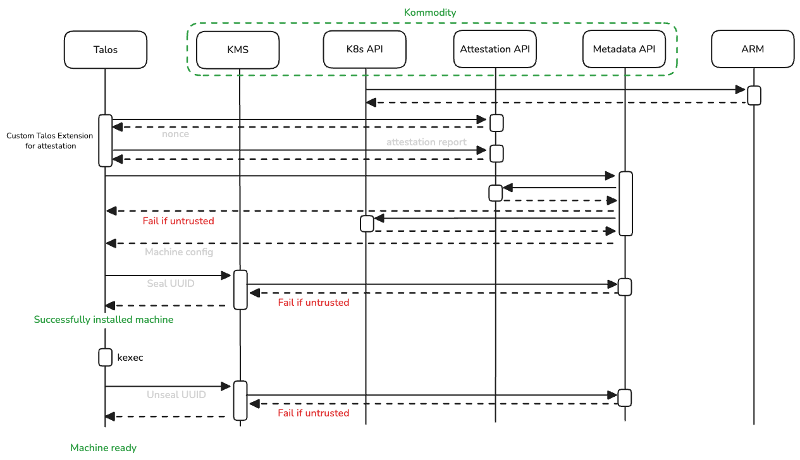

## Security

### Talos Machine Trust

Before a Talos machine receives any secret material from Kommodity, it must prove
its boot-time integrity via TPM-backed remote attestation. The
[attestation extension](https://github.com/kommodity-io/kommodity-attestation-extension)
runs on the node and drives the protocol; Kommodity hosts the verifier in
[`pkg/attestation`](pkg/attestation).

**Flow:**

1. **Nonce.** The node calls `GET /nonce`. The server generates a 256-bit random
   nonce, binds it to the requesting IP, and stores it with a TTL (single-use).
2. **Report.** The extension collects per-component measurements (Secure Boot,
   AppArmor, SELinux, kernel lockdown, installed extensions, …) and SHA-256 PCRs,
   then asks the TPM to produce an ECDSA quote over the PCRs with the nonce as
   `ExtraData`. The full report — components, PCRs, quote, signature, TPM public
   key — is POSTed to `/report`.
3. **Persist.** The server consumes the nonce (rejecting mismatched IP or expired
   entries), resolves the owning CAPI `Machine` from the source IP, and stores
   the report as a `ConfigMap` and the nonce as a `Secret` in `kommodity-system`,
   labelled with node UUID, node IP, and cluster.
4. **Verify.** Other services (e.g. the metadata service before delivering user
   data) call `GET /report/{ip}/trust`. The verifier:
   - parses the TPM quote (`TPMS_ATTEST`) and checks that its `ExtraData` equals
     the stored nonce,
   - recomputes the PCR digest from the reported PCRs and confirms it matches
     the digest inside the quote,
   - verifies the ECDSA signature over the quote with the supplied TPM public
     key,
   - loads the cluster's `attestation-policy-<cluster>` `ConfigMap` and rejects
     the machine if any required component measurement or PCR value diverges
     from policy.
5. **Gate.** A non-`200` response from the trust endpoint causes downstream
   services to refuse the request — for example, the metadata service returns
   `401` instead of handing over machine config.

This binds every secret delivery to a fresh TPM quote that proves the machine
booted into the expected software state.

#### References

- [TPM 2.0 Library Specification — Part 1: Architecture](https://trustedcomputinggroup.org/resource/tpm-library-specification/)
- [`go-tpm`](https://github.com/google/go-tpm) — TPM 2.0 client library used by the verifier

### Disk Encryption

Talos Linux system volumes (`STATE` and `EPHEMERAL`) are encrypted at rest using LUKS2,
with encryption keys managed by the Kommodity KMS. Talos calls the KMS over its
[gRPC API](https://github.com/siderolabs/kms-client) during boot to seal a freshly
generated LUKS key on first boot, and to unseal it on every subsequent boot.

**Per-volume keys.** A separate AES-256-GCM key is generated for each encrypted
volume (one for `STATE`, one for `EPHEMERAL`). All key material for a node lives in
a single Kubernetes `Secret` in the `kommodity-system` namespace, named
`<cluster>-kms-<node-uuid>` and labelled with `app.kubernetes.io/managed-by=kommodity`,
`cluster.x-k8s.io/cluster-name`, `talos.dev/node-uuid`, and `talos.dev/node-ip`.

**AAD binding.** Each LUKS key is encrypted with AES-256-GCM using Additional
Authenticated Data built from `nodeUUID || aadNonce || clientIP`. The 32-byte
`aadNonce` is generated per volume; the client IP is resolved from
`X-Forwarded-For`, `X-Real-Ip`, `X-Envoy-External-Address`, or the gRPC peer
address, in that order. Both Seal and Unseal reject requests whose source IP does
not match the IP that originally sealed the secret.

**Implementation:** [`pkg/kms`](pkg/kms).

#### Caveats

When the KMS protects the `STATE` partition, network configuration cannot be
supplied via the machine configuration and custom CA certificates cannot be used
for the KMS endpoint — the KMS must be reachable before `STATE` is unlocked, and
the machine config itself lives on `STATE`.

#### References

- [Talos Disk Encryption](https://docs.siderolabs.com/talos/v1.12/configure-your-talos-cluster/storage-and-disk-management/disk-encryption)
- [SideroLabs KMS Client API](https://github.com/siderolabs/kms-client)
- [NIST SP 800-38D — GCM Specification](https://csrc.nist.gov/publications/detail/sp/800-38d/final)
