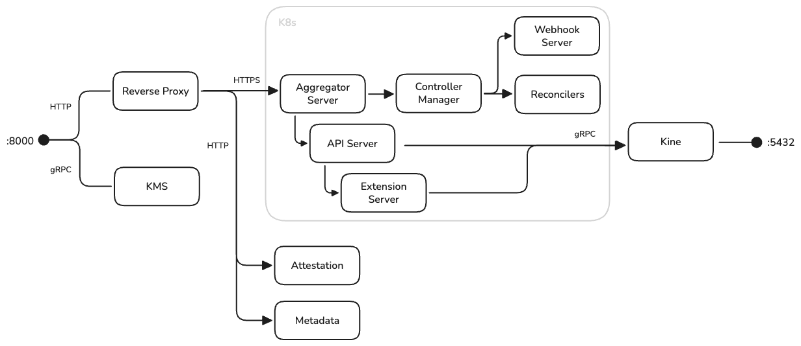

# Make Sovereign Cloud Boring: How We Built a Single Binary to Run Kubernetes Anywhere

*Getting multi-cloud wrong is easy. Building a truly sovereign stack across cloud providers is hard. Here's how Corti's platform team built Kommodity - an open-source infrastructure platform that brings together Talos Linux and Cluster API to deploy compliant, disk-encrypted Kubernetes clusters using kubectl and Helm.*

---

## What Is Sovereign Cloud, and Why Should You Care?

**Sovereign cloud** means maintaining complete control over your infrastructure, data, and operations - independent of any single vendor. It's not about avoiding the cloud; it's about ensuring that:

- **Your data stays where you put it**: Jurisdictional control matters when [GDPR fines can reach 4% of global turnover](https://gdpr-info.eu/art-83-gdpr/)
- **Your keys are your keys**: Encryption where you - not your cloud provider - control the master keys
- **Your machines are verifiable**: Hardware-rooted trust, not "trust us, we're the cloud"
- **Your operations are portable**: The ability to move between providers without rewriting everything

For regulated industries - healthcare, finance, government - sovereign cloud isn't a buzzword. It's a compliance requirement.

The problem? Building sovereign infrastructure is *hard*. You need expertise in multiple clouds, key management, hardware security modules, compliance frameworks, and operational tooling. Most organizations either pay enormous consulting fees or accept that "sovereign" means "one specific hyperscaler's sovereign offering."

We wanted a third option: make sovereign cloud *boring*. As routine as deploying any other Kubernetes cluster.

---

## Our Starting Point: Healthcare AI with Nowhere to Hide

At Corti, we build AI infrastructure and tools that assist healthcare professionals. Our infrastructure requirements are driven by regulation, not architecture astronautics:

- **Data sovereignty**: Patient data must stay in specific jurisdictions. Some customers require on-premise deployments
- **Compliance**: GDPR, ISO 27001, SOC 2. Encryption at rest isn't optional - it's legally required
- **Auditability**: When regulators ask "who accessed what, when?", we need answers
- **Operational sanity**: A small platform team managing infrastructure across multiple environments

We evaluated the landscape honestly:

**Terraform** works well, but requires provider-specific knowledge. Each cloud has different resource models, networking semantics, and quirks. You can abstract some of this with modules, but you're still managing HCL, state files, and the cognitive load of multiple providers.

**Managed Kubernetes** (EKS, AKS, GKE) solves the control plane problem but introduces vendor lock-in. Each provider's implementation differs in networking, IAM, and operational tooling. You can't easily run the same workload definition across providers.

**[Cluster API](https://cluster-api.sigs.k8s.io/)** provides a Kubernetes-native abstraction for cluster lifecycle management - exactly what we wanted - but requires running a full management cluster with etcd, plus separate infrastructure and bootstrap providers.

We wanted Cluster API's declarative model, but without the operational overhead of running a separate management cluster. And we needed first-class support for disk encryption and hardware attestation.

So we built Kommodity.

---

## What Kommodity Actually Is

Kommodity packages several proven components into a single binary:

- **Kubernetes API server** (via the `k8s.io/apiserver` library)
- **Cluster API controllers** for cluster lifecycle management
- **Talos Linux bootstrap/control plane providers** for immutable machine configuration
- **[Kine](https://github.com/k3s-io/kine)** for database-backed storage (no etcd required)
- **KMS service** for disk encryption key management
- **Attestation service** for TPM-based machine verification
- **Metadata service** for secure machine configuration delivery

One port. One process. PostgreSQL for state.



---

## Why Talos Linux Matters for Compliance

Traditional Linux distributions are general-purpose - and that's the problem. Every SSH session, every package installation, every configuration change creates drift. Auditors ask "how do you know this machine hasn't been tampered with?" and you're left pointing at configuration management that *should* have prevented it.

[Talos Linux](https://www.talos.dev/) takes a different approach:

- **No shell access**: No SSH, no login, no package manager - the shell is entirely removed
- **Immutable root filesystem**: Boots from an in-memory SquashFS image; the root filesystem is read-only
- **API-driven configuration**: All changes via authenticated gRPC API, validated before application
- **Kernel hardening**: [KSPP](https://kernsec.org/wiki/index.php/Kernel_Self_Protection_Project) hardened by default, signed kernel modules required
- **Security modules**: SELinux included (permissive by default; enforcing mode available via kernel cmdline)
- **Secure Boot & Trusted Boot**: Full UEFI Secure Boot support with signed UKI images; TPM-based Trusted Boot for boot chain verification

When auditors ask about machine integrity, the answer becomes: "The OS boots from a signed, read-only image. There's no shell to compromise. Configuration changes require cryptographic authentication. Here's the audit log."

This isn't about theoretical security - it's about having defensible answers during compliance reviews. For details, see the [Talos security documentation](https://www.siderolabs.com/blog/security-in-kubernetes-infrastructure/).

---

## The Machine Trust Problem

**Why this matters for sovereignty**: If you can't verify that a machine is what it claims to be, you can't trust your infrastructure. Period.

Here's a scenario that should concern you: an attacker compromises your cloud credentials. They provision a machine that looks legitimate - same AMI, same network, same tags. Your automation happily bootstraps it into your cluster. Now they're inside your network, with access to your secrets, your data, your everything.

In traditional setups, machine identity is often just "being on the right network" or "having the right bootstrap token." Neither is sufficient when your threat model includes compromised cloud accounts - which, for sovereign infrastructure, it must.

We wanted hardware-rooted trust: a machine proves its identity using its TPM before receiving any sensitive configuration. This is the "verify" in "trust but verify" - except we skip the "trust" part entirely.

### The Attestation Flow

**The short version**: Before a machine gets any secrets, it must cryptographically prove it's running the exact software you expect, using tamper-proof hardware. If anything is wrong - different kernel, unauthorized extension, security controls disabled - no secrets are delivered.


**The detailed sequence**:

1. **Machine boots** with the [attestation extension](https://github.com/kommodity-io/kommodity-attestation-extension) installed
2. **Nonce request**: Machine requests a cryptographic nonce from Kommodity's attestation endpoint
3. **TPM quote generation**: The machine's TPM generates a signed quote containing:
   - [Platform Configuration Register (PCR)](https://www.systutorials.com/understanding-tpm-2-0-and-platform-configuration-registers-pcrs/) values - a hash chain of what booted
   - The nonce (binds the quote to this specific request)
   - ECDSA signature from the TPM's Attestation Key (AK)
4. **Report submission**: Machine submits the quote plus software measurements (kernel version, extensions, security settings)
5. **Verification**: Kommodity validates:
   - TPM signature is cryptographically valid
   - PCR values match expected policy
   - Software measurements match expected fingerprint
6. **Trust decision**: Pass → machine receives configuration. Fail → connection rejected.

Only after attestation succeeds does the metadata service provide the Talos machine configuration. The KMS service validates the node UUID on each request - the trust relationship is established through the attestation flow before machines reach the KMS.

### What We Measure

The [attestation extension](https://github.com/kommodity-io/kommodity-attestation-extension) gathers:

| Measurement | Why It Matters |
|------------|----------------|
| AppArmor | Mandatory Access Control restricting process capabilities - detects if security policies are bypassed |
| SELinux | Enforcement mode (disabled/permissive/enforcing) - ensures expected access control is active |
| Secure Boot | UEFI signature verification of boot chain - confirms only signed, trusted code executed during boot |
| Kernel Lockdown | Prevents runtime kernel modification - blocks rootkits and unauthorized kernel modules |
| SquashFS | Read-only root filesystem verification - ensures OS immutability hasn't been compromised |
| Talos Extensions | SHA-512 hashes of installed extensions - detects unauthorized or tampered extensions |
| Image Layers | Cryptographic verification of OS image components - confirms expected base image and layers |
| Talos Version | OS version fingerprint - ensures machines run approved, patched versions |

The verification in Kommodity (`pkg/attestation/rest/models.go`) performs:

1. **TPM quote parsing**: Extracts the attestation structure and verifies the nonce matches
2. **PCR digest validation**: Recomputes the PCR digest from submitted values and compares against the quote
3. **ECDSA signature verification**: Verifies the TPM signature over the quote using the TPM's public key
4. **Component validation**: Compares SHA-512 measurements against the policy
5. **PCR value validation**: Compares PCR values against expected policy values

If any check fails, the machine is rejected. No secrets are delivered.

---

## Disk Encryption Key Management

**Why this matters for sovereignty**: Encryption is meaningless if your cloud provider holds the keys. True sovereignty means *you* control the encryption keys - and can revoke them instantly if needed.

Compliance frameworks require encryption at rest. The question is: where do the keys live?

Common approaches and their tradeoffs:

| Approach | Problem |
|----------|---------|
| Keys baked into images | Anyone with the image has the key |
| Cloud provider KMS | Vendor lock-in; key accessible to cloud provider |
| Manual key distribution | Doesn't scale; operational burden |
| LUKS with passphrase | Who enters the passphrase on boot? |

Kommodity implements a network-based KMS that ties encryption keys to machine identity:

```go
// Simplified example based on pkg/kms/server.go (error handling and some steps omitted)
func (s *ServiceServer) Seal(ctx context.Context, req *kms.Request) (*kms.Response, error) {
    nodeUUID, err := validateNodeUUID(req)
    if err != nil {
        return nil, fmt.Errorf("failed to validate node UUID: %w", err)
    }

    // Extract client IP from gRPC peer context
    client, ok := peer.FromContext(ctx)
    if !ok {
        return nil, ErrEmptyClientContext
    }
    host, _, err := net.SplitHostPort(client.Addr.String())

    // Get or create encryption key for this node
    kubeClient, _ := clientgoclientset.NewForConfig(s.config.ClientConfig.LoopbackClientConfig)
    encryptionKey, err := getEncryptionKey(ctx, kubeClient, nodeUUID)
    if apierrors.IsNotFound(err) {
        encryptionKey, err = createEncryptionKey(ctx, kubeClient, nodeUUID, host)
    }

    // AES-256-GCM encryption
    encryptedData, err := encrypt(encryptionKey, data)
    return &kms.Response{Data: encryptedData}, nil
}
```

Each node gets a unique 256-bit key stored as a Kubernetes Secret in Kommodity's database. The key is:
- Generated on first boot
- Never stored on the machine itself
- Retrieved via network on every boot
- Tied to the machine's UUID

**Key revocation is deletion**: remove the Secret, and the machine can no longer decrypt its disk.

### The Network Dependency Tradeoff

This design has important operational implications:

**Machines cannot boot without network access to Kommodity.** This is intentional - it ensures compromised machines can be denied access - but it means Kommodity becomes a critical dependency.

**Bootstrapping challenge for STATE partition encryption**: When using network KMS for the STATE partition (which contains Talos configuration and secrets), network configuration cannot come from the machine config - because the machine config is *in* the encrypted STATE partition. This requires out-of-band network configuration (e.g., via kernel cmdline or DHCP). See the [Talos disk encryption documentation](https://docs.siderolabs.com/talos/v1.9/configure-your-talos-cluster/storage-and-disk-management/disk-encryption) for details.

For production deployments, you need:
- Highly available PostgreSQL
- Kommodity deployed with appropriate redundancy
- Network paths that survive individual node failures
- Out-of-band network configuration for STATE partition encryption

These constraints define the operational dependencies you need to plan for.

---

## Cluster Provisioning with Cluster API

With the security foundation in place, let's look at how clusters are actually provisioned.

### A Sovereign Deployment in Practice

Imagine you're deploying a healthcare application that must comply with EU data residency requirements. You need:
- A production cluster in Frankfurt (Azure) for German customers
- A production cluster in Paris (Scaleway) for French customers
- A disaster recovery cluster in a private datacenter (KubeVirt)

With Kommodity, this becomes three YAML files and a single operational model. Each cluster gets:
- TPM-attested machines that prove their integrity before receiving secrets
- Disk encryption with keys you control (not Azure, not Scaleway - you)
- The same `kubectl` and Helm workflows across all environments
- Unified audit logging for compliance reporting

No cloud-specific tooling. No vendor-specific key management. No "works differently in production than in DR."

That's what we mean by making sovereign cloud boring.

### The Resources

Kommodity uses standard Cluster API resources:

```yaml
# cluster.yaml - the orchestrating resource
apiVersion: cluster.x-k8s.io/v1beta1
kind: Cluster
metadata:
  name: production-paris
  namespace: clusters
spec:
  clusterNetwork:
    pods:
      cidrBlocks: ["10.244.0.0/16"]
    services:
      cidrBlocks: ["10.96.0.0/12"]
  controlPlaneRef:
    apiVersion: controlplane.cluster.x-k8s.io/v1beta1
    kind: TalosControlPlane
    name: production-paris-control-plane
  infrastructureRef:
    apiVersion: infrastructure.cluster.x-k8s.io/v1alpha1
    kind: ScalewayCluster
    name: production-paris
```

The `Cluster` resource references:
- **TalosControlPlane**: Manages control plane nodes using Talos Linux
- **ScalewayCluster** (or AzureCluster, KubeVirtCluster): Provider-specific infrastructure

Apply with `kubectl`:

```bash
kubectl --kubeconfig kommodity.yaml apply -f cluster.yaml
```

Kommodity's controllers reconcile the desired state:
1. Create cloud infrastructure (VPC, subnets, load balancers)
2. Provision machines with Talos Linux
3. Wait for attestation to pass
4. Deliver machine configuration via metadata service
5. Bootstrap Kubernetes control plane
6. Join worker nodes

The same workflow applies regardless of provider. The YAML changes, but the operational model stays consistent.

### Multi-Cloud Reality Check

I want to be honest about what "multi-cloud" means in practice.

Different providers use different API versions:
- Scaleway: `infrastructure.cluster.x-k8s.io/v1alpha1`
- Azure: `infrastructure.cluster.x-k8s.io/v1beta1`
- Docker: `infrastructure.cluster.x-k8s.io/v1beta1`

Each provider has different capabilities. Scaleway has public gateways. Azure has managed identities. KubeVirt runs on existing virtualization platforms.

You can't just swap `ScalewayCluster` for `AzureCluster` and expect identical behavior. What you *can* do is use the same operational patterns:
- Same tooling (`kubectl`, Helm, GitOps)
- Same observability approach
- Same RBAC model
- Same team skills

The value isn't "write once, run anywhere" - it's "learn once, operate anywhere."

---

## Auto-Bootstrap: Eliminating Manual Cluster Initialization

Traditional Kubernetes bootstrap requires designating a first control plane node to initialize the cluster. In automated environments, this creates a sequencing problem: which node goes first?

The [auto-bootstrap extension](https://github.com/kommodity-io/kommodity-autobootstrap-extension) handles this automatically:

1. **Control plane detection**: Extension only activates on nodes with etcd secrets configured
2. **Peer discovery**: Scans local network CIDR for other Talos nodes
3. **Deterministic leader election**: Based on boot time and IP address
4. **Quorum wait**: Leader waits for configured number of peers
5. **Bootstrap execution**: Leader initializes; others join as the cluster forms

```yaml
machine:
  install:
    extensions:
      - image: ghcr.io/kommodity-io/kommodity-autobootstrap-extension:vX.Y.Z # Use the latest release tag from GitHub
  env:
    KOMMODITY_AUTOBOOTSTRAP_NETWORK_CIDR: "10.0.0.0/24"
    KOMMODITY_AUTOBOOTSTRAP_QUORUM: "3"
```

This enables fully declarative cluster creation: apply a manifest, and three nodes coordinate to form an HA control plane without intervention.

### Private Networks Only

Auto-bootstrap is designed exclusively for private networks. Peer discovery scans the configured CIDR without TLS verification, which is appropriate for isolated infrastructure networks but not for shared or untrusted environments. The bootstrap process itself remains protected by Talos's certificate-based authentication once peers are discovered.

---

## Authentication: OIDC and ServiceAccounts

Kommodity supports two authentication mechanisms:

**OIDC** for human users:
```bash
export KOMMODITY_OIDC_ISSUER_URL=https://accounts.google.com
export KOMMODITY_OIDC_CLIENT_ID=your-client-id
export KOMMODITY_OIDC_USERNAME_CLAIM=email
export KOMMODITY_OIDC_GROUPS_CLAIM=groups
export KOMMODITY_ADMIN_GROUP=platform-team@yourcompany.com
```

Users authenticate with their corporate identity provider. Groups from the IdP map to authorization decisions.

**ServiceAccount tokens** for automation:

Kommodity generates tokens using a dedicated RSA signing key, stored separately from TLS certificates. This allows independent key rotation and survives certificate renewals.

The authorization model is straightforward:
- `system:masters` group → full access (Kubernetes convention)
- Configured admin group → full access
- `system:serviceaccounts` → access for authenticated service accounts
- Everyone else → denied

---

## Cluster Addons: Batteries Included, Customization Welcome

Kommodity doesn't just provision empty clusters - it includes an addon system that bootstraps essential components automatically.

### Supported Addons

**[Cilium CNI](https://cilium.io/)** (enabled by default):
- eBPF-based networking with kube-proxy replacement
- Hubble observability (UI + relay)
- BGP control plane support
- Pre-configured for Talos Linux security contexts

**[ArgoCD](https://argo-cd.readthedocs.io/)** (optional):
- GitOps-ready cluster management
- Deployed via `KubectlApply` mode for easy GitOps adoption

### Bring Your Own Addons

The addon system is extensible - any Helm chart can be deployed as a cluster addon:

```yaml
kommodity:
  addons:
    cnpg:  # CloudNative PostgreSQL - replace managed databases
      enabled: true
      namespace: cnpg-system
      lifecycle:
        install:
          mode: HelmInstall
        upgrade:
          disable: true  # Let GitOps manage after initial install
      chart:
        repository: https://cloudnative-pg.github.io/charts
        name: cloudnative-pg
        version: 0.23.0
```

This enables you to replace cloud-managed services with sovereign alternatives:
- **[CNPG](https://cloudnative-pg.io/)** instead of RDS/Cloud SQL - your data, your database, your control
- **[Strimzi](https://strimzi.io/)** instead of managed Kafka
- **[Rook/Ceph](https://rook.io/)** instead of managed object storage (when data must never leave your infrastructure)

Addons deploy as inline manifests in the TalosControlPlane, available immediately after bootstrap. GitOps tools like ArgoCD or Flux can then "adopt" them for ongoing management (`upgrade.disable: true` prevents Kommodity from overwriting GitOps changes).

---

## Audit Logging

Kommodity implements Kubernetes-native audit logging:

```yaml
apiVersion: audit.k8s.io/v1
kind: Policy
rules:
  - level: RequestResponse
    resources:
      - group: "cluster.x-k8s.io"
        resources: ["clusters", "machines"]
  - level: Metadata
    resources:
      - group: ""
        resources: ["secrets"]
```

Every API request records: authenticated user, source IP, timestamp, request body (at configured level), and response. This satisfies audit requirements for most compliance frameworks.

---

## Operational Realities

Let's talk about what running Kommodity actually looks like.

### Single Point of Failure?

Kommodity is a single binary, which might sound like a single point of failure. In practice, it's less critical than you'd think:

- **Existing clusters are independent**: Once bootstrapped, clusters don't depend on Kommodity for normal operation. Your workloads keep running.
- **Reconciliation is periodic, not constant**: Cluster API controllers reconcile state, but they're not in a tight loop. An occasional Kommodity outage during normal operations doesn't harm anything.
- **Critical only during changes**: Kommodity availability matters when you're provisioning new clusters, scaling nodes, or performing upgrades. Outside of those operations, it can be down without impact.

For production, we recommend:
- **One Kommodity instance per environment type** (dev, staging, production) for segregation. This limits blast radius and prevents a misconfiguration in dev from affecting production clusters.
- **Multiple replicas per instance** behind a load balancer - not because downtime is catastrophic, but because it's good practice and simplifies maintenance windows.
- **HA PostgreSQL** per instance (managed PostgreSQL services or CNPG work well).

### Upgrade Strategy

Kommodity uses standard Kubernetes API versioning. CRDs are embedded in the binary and applied on startup. Upgrades follow this pattern:

1. Update the Kommodity deployment (rolling update)
2. New version applies updated CRDs
3. Controllers reconcile with new logic

There's no separate migration step, but you should:
- Test upgrades in staging first
- Review CRD changes between versions
- Plan for controller behavior changes

### Network Dependencies

When security features are enabled, machines depend on Kommodity for:
- Attestation verification
- Metadata delivery (Talos configuration)
- KMS key retrieval

Network partitions between machines and Kommodity prevent new machines from booting when these features are active.

**However, these features are optional.** If your compliance requirements don't mandate hardware attestation or network-based disk encryption, you can run Kommodity clusters without them. In this mode, Kommodity functions purely as a Cluster API management plane - machines boot independently using standard Talos configuration methods, and Kommodity's availability only affects cluster lifecycle operations (scaling, upgrades), not running workloads.

Choose based on your needs:
- **Strict compliance** (healthcare, finance, government): Enable attestation + KMS
- **Standard deployments**: Kommodity as management plane only, reduced network dependency

### What Kommodity Doesn't Do

To set appropriate expectations:

- **Not zero-ops**: You're running infrastructure. There will be incidents. Kommodity reduces complexity but doesn't eliminate operational responsibility.
- **Not a full PaaS**: Kommodity provisions and manages Kubernetes clusters. What you run on those clusters is up to you.
- **Requires Kubernetes expertise**: This is a tool for platform teams, not application developers. You should be comfortable with `kubectl`, Helm, and Kubernetes concepts.
- **Not a silver bullet for multi-cloud**: It abstracts cluster lifecycle management, but you still need to understand provider-specific features and limitations.
---

## TL;DR: What Makes Kommodity Different

If you've skimmed this far, here's the summary:

| Traditional Approach | Kommodity Approach |
|---------------------|-------------------|
| Learn each cloud's tools | One API (`kubectl`) for all clouds |
| Trust machines by network location | Verify machines cryptographically (TPM) |
| Cloud provider manages encryption keys | You manage encryption keys |
| Separate tools for different environments | Same workflow everywhere |
| Compliance bolted on after the fact | Compliance built in from the start |
| Managed services = vendor lock-in | Bring your own addons (CNPG, Strimzi, etc.) |

The goal isn't to avoid cloud providers - it's to ensure you're never *locked in* to one.

---

## When to Use Kommodity

Kommodity makes sense when:

- You deploy across multiple cloud providers or hybrid environments
- Compliance requires disk encryption with controlled key management
- You need hardware attestation for machine trust
- Your team already knows Kubernetes and wants consistent operational patterns
- You're building a platform for other teams to consume
- **Even on a single cloud**: You want the *option* to move. Vendor lock-in is expensive, and portability built from day one is cheaper than migration later.

Kommodity probably isn't for you if:

- You prefer click-ops (manual GUI-based operations) over declarative infrastructure
- You don't have Kubernetes operational expertise (yet)
- You're happy with your current managed Kubernetes and have no portability concerns

---

## Getting Started

```bash
# Clone
git clone https://github.com/kommodity-io/kommodity
cd kommodity

# Local development setup (requires Docker)
make setup
make build-ui
make run

# Connect
kubectl --kubeconfig kommodity.yaml get clusters
```

For production:
- Helm chart for clusters: `charts/kommodity`
- Azure Terraform module for Kommodity: `terraform/modules/azure`
- Container images: `ghcr.io/kommodity-io/kommodity`

---

## Conclusion: Sovereignty Should Be Boring

The best infrastructure is the kind you don't think about. It works. It's secure. It's auditable. It doesn't wake you up at night.

Sovereign cloud has a reputation for being complex, expensive, and requiring specialized expertise. That's because most sovereign solutions are bolt-ons - compliance features added after the fact to platforms designed for different priorities.

Kommodity takes the opposite approach. Sovereignty is built in from the start:

- **Verifiable machines**: TPM attestation means you *know* your infrastructure is what you deployed
- **Controlled encryption**: Your keys, your control, instant revocation
- **Portable operations**: The same `kubectl` workflows whether you're on a hyperscaler, a regional cloud, or bare metal
- **Auditable by design**: Every API call logged, every change tracked

It's not magic. It's a thoughtful combination of existing, proven tools - Talos Linux, Cluster API, Kine - packaged in a way that makes sovereign cloud as routine as any other deployment.

**One binary. Kubernetes APIs. Verifiable machines. Encrypted disks.**

That's sovereign cloud, made boring. And boring is exactly what infrastructure should be.

---

*Kommodity is developed by the platform team at [Corti](https://corti.ai) and released under Apache 2.0. Contributions welcome at [github.com/kommodity-io/kommodity](https://github.com/kommodity-io/kommodity).*

---

## References

- [Talos Linux Documentation](https://docs.siderolabs.com/talos/)
- [Talos Linux Security Overview](https://www.siderolabs.com/blog/security-in-kubernetes-infrastructure/)
- [Talos Disk Encryption](https://docs.siderolabs.com/talos/v1.9/configure-your-talos-cluster/storage-and-disk-management/disk-encryption)
- [Cluster API Documentation](https://cluster-api.sigs.k8s.io/)
- [Cluster API Bootstrap Provider for Talos](https://github.com/siderolabs/cluster-api-bootstrap-provider-talos)
- [Cluster API Control Plane Provider for Talos](https://github.com/siderolabs/cluster-api-control-plane-provider-talos)
- [Kine - etcd shim for SQL databases](https://github.com/k3s-io/kine)
- [TPM 2.0 and Platform Configuration Registers](https://www.systutorials.com/understanding-tpm-2-0-and-platform-configuration-registers-pcrs/)
- [Kommodity GitHub Repository](https://github.com/kommodity-io/kommodity)
- [Kommodity Attestation Extension](https://github.com/kommodity-io/kommodity-attestation-extension)
- [Kommodity Auto-Bootstrap Extension](https://github.com/kommodity-io/kommodity-autobootstrap-extension)
