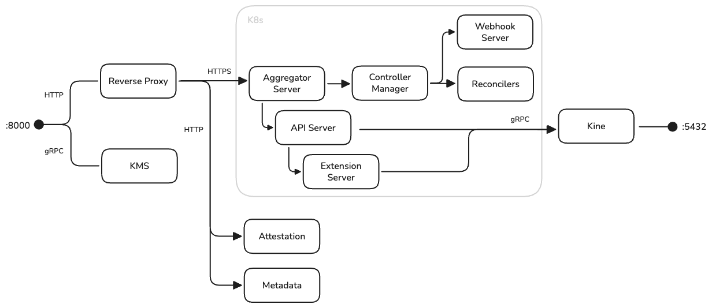

# Make Sovereign Cloud Boring: Why We Built Kommodity

*Part 1 of 3 in the Kommodity series*

*Getting multi-cloud wrong is easy. Building a truly sovereign stack across cloud providers is hard. Here's how Corti's platform team built Kommodity - an open-source infrastructure platform that brings together Talos Linux and Cluster API to deploy compliant, disk-encrypted Kubernetes clusters using kubectl and Helm.*

---

## What Is Sovereign Cloud, and Why Should You Care?

**Sovereign cloud** means maintaining complete control over your infrastructure, data, and operations - independent of any single vendor. It's not about avoiding the cloud; it's about ensuring that:

- **Your data stays where you put it**: Jurisdictional control matters when [GDPR fines can reach 4% of global turnover](https://gdpr-info.eu/art-83-gdpr/)
- **Your keys are your keys**: Encryption where you - not your cloud provider - control the master keys
- **Your machines are verifiable**: Hardware-rooted trust, not "trust us, we're the cloud"
- **Your operations are portable**: The ability to move between providers without rewriting everything

For regulated industries - healthcare, finance, government - sovereign cloud isn't a buzzword. It's a compliance requirement.

The problem? Building sovereign infrastructure is *hard*. You need expertise in multiple clouds, key management, hardware security modules, compliance frameworks, and operational tooling. Most organizations either pay enormous consulting fees or accept that "sovereign" means "one specific hyperscaler's sovereign offering."

We wanted a third option: make sovereign cloud *boring*. As routine as deploying any other Kubernetes cluster.

---

## Our Starting Point: Healthcare AI with Nowhere to Hide

At Corti, we build AI infrastructure and tools that assist healthcare professionals. Our infrastructure requirements are driven by regulation, not architecture astronautics:

- **Data sovereignty**: Patient data must stay in specific jurisdictions. Some customers require on-premise deployments
- **Compliance**: GDPR, ISO 27001, SOC 2. Encryption at rest isn't optional - it's legally required
- **Auditability**: When regulators ask "who accessed what, when?", we need answers
- **Operational sanity**: A small platform team managing infrastructure across multiple environments

We evaluated the landscape honestly:

**Terraform** works well, but requires provider-specific knowledge. Each cloud has different resource models, networking semantics, and quirks. You can abstract some of this with modules, but you're still managing HCL, state files, and the cognitive load of multiple providers.

**Managed Kubernetes** (EKS, AKS, GKE) solves the control plane problem but introduces vendor lock-in. Each provider's implementation differs in networking, IAM, and operational tooling. You can't easily run the same workload definition across providers.

**[Cluster API](https://cluster-api.sigs.k8s.io/)** provides a Kubernetes-native abstraction for cluster lifecycle management - exactly what we wanted - but requires running a full management cluster with etcd, plus separate infrastructure and bootstrap providers.

We wanted Cluster API's declarative model, but without the operational overhead of running a separate management cluster. And we needed first-class support for disk encryption and hardware attestation.

So we built Kommodity.

---

## What Kommodity Actually Is

Kommodity packages several proven components into a single binary:

- **Kubernetes API server** (via the `k8s.io/apiserver` library)
- **Cluster API controllers** for cluster lifecycle management
- **Talos Linux bootstrap/control plane providers** for immutable machine configuration
- **[Kine](https://github.com/k3s-io/kine)** for database-backed storage (no etcd required)
- **KMS service** for disk encryption key management
- **Attestation service** for Trusted Platform Module (TPM) based machine verification
- **Metadata service** for secure machine configuration delivery

One port. One executable. PostgreSQL for state.



---

## Why Talos Linux Matters for Compliance

Traditional Linux distributions are general-purpose - and that's the problem. Every SSH session, every package installation, every configuration change creates drift. Auditors ask "how do you know this machine hasn't been tampered with?" and you're left pointing at configuration management that *should* have prevented it.

[Talos Linux](https://www.talos.dev/) takes a different approach:

- **No shell access**: No SSH, no login, no package manager - the shell is entirely removed
- **Immutable root filesystem**: Boots from an in-memory SquashFS image; the root filesystem is read-only
- **API-driven configuration**: All changes via authenticated gRPC API, validated before application
- **Kernel hardening**: [KSPP](https://kernsec.org/wiki/index.php/Kernel_Self_Protection_Project) hardened by default, signed kernel modules required
- **Security modules**: SELinux included (permissive by default; enforcing mode available via kernel cmdline)
- **Secure Boot & Trusted Boot**: Full UEFI Secure Boot support with signed UKI images; TPM-based Trusted Boot for boot chain verification

When auditors ask about machine integrity, the answer becomes: "The OS boots from a signed, read-only image. There's no shell to compromise. Configuration changes require cryptographic authentication. Here's the audit log."

This isn't about theoretical security - it's about having defensible answers during compliance reviews. For details, see the [Talos security documentation](https://www.siderolabs.com/blog/security-in-kubernetes-infrastructure/).

---

## TL;DR: What Makes Kommodity Different

| Traditional Approach | Kommodity Approach |
|---------------------|-------------------|
| Learn each cloud's tools | One API (`kubectl`) for all clouds |
| Trust machines by network location | Verify machines cryptographically (TPM) |
| Cloud provider manages encryption keys | You manage encryption keys |
| Separate tools for different environments | Same workflow everywhere |
| Compliance bolted on after the fact | Compliance built in from the start |
| Managed services = vendor lock-in | Bring your own addons (CNPG, Strimzi, etc.) |

The goal isn't to avoid cloud providers - it's to ensure you're never *locked in* to one.

---

## When to Use Kommodity

Kommodity makes sense when:

- You deploy across multiple cloud providers or hybrid environments
- Compliance requires disk encryption with controlled key management
- You need hardware attestation for machine trust
- Your team already knows Kubernetes and wants consistent operational patterns
- You're building a platform for other teams to consume
- **Even on a single cloud**: You want the *option* to move. Vendor lock-in is expensive, and portability built from day one is cheaper than migration later.

Kommodity probably isn't for you if:

- You prefer click-ops (manual GUI-based operations) over declarative infrastructure
- You don't have Kubernetes operational expertise (yet)
- You're happy with your current managed Kubernetes and have no portability concerns

---

## Getting Started

```bash
# Clone
git clone https://github.com/kommodity-io/kommodity
cd kommodity

# Local development setup (requires Docker)
make setup
make build-ui
make run

# Connect
kubectl --kubeconfig kommodity.yaml get clusters
```

For production deployment options, see the [Kommodity GitHub repository](https://github.com/kommodity-io/kommodity).

---

## Conclusion: The Foundation Is Set

We've covered why sovereign cloud matters, why existing solutions fall short, and how Kommodity packages Cluster API, Talos Linux, and essential security services into a single deployable binary.

But a platform is only as trustworthy as the machines it runs on. How do you know that a machine joining your cluster is actually *your* machine - and not a compromised impostor? How do you ensure disk encryption keys never fall into the wrong hands?

In the next article, we'll dive deep into the security foundations that make Kommodity's sovereignty claims defensible: TPM-based hardware attestation and network-based key management.

---

*Kommodity is developed by the platform team at [Corti](https://corti.ai) and released under Apache 2.0. Contributions welcome at [github.com/kommodity-io/kommodity](https://github.com/kommodity-io/kommodity).*

---

## References

- [Talos Linux Documentation](https://docs.siderolabs.com/talos/)
- [Talos Linux Security Overview](https://www.siderolabs.com/blog/security-in-kubernetes-infrastructure/)
- [Cluster API Documentation](https://cluster-api.sigs.k8s.io/)
- [Kine - etcd shim for SQL databases](https://github.com/k3s-io/kine)
- [Kommodity GitHub Repository](https://github.com/kommodity-io/kommodity)
