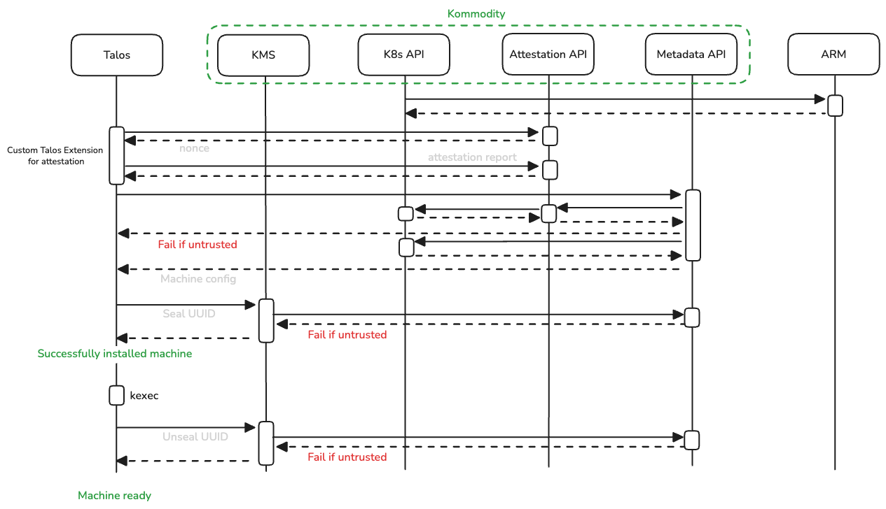

# Hardware-Rooted Trust: TPM Attestation and Sovereign Key Management

*Part 2 of 3 in the Kommodity series*

*Trust is easy to claim, hard to prove. In sovereign infrastructure, "trust me" isn't good enough - you need cryptographic proof that machines are exactly what they claim to be, and encryption keys that never leave your control. This article covers both: TPM-based hardware attestation and network-delivered disk encryption.*

---

In [Part 1](./001_why_sovereign_cloud.md), we introduced Kommodity and explained why sovereign cloud requires more than just running workloads on compliant infrastructure. We covered the architecture: a single binary packaging Cluster API, Talos Linux providers, and security services.

But architecture alone doesn't make infrastructure trustworthy. This article dives into the security foundations: how Kommodity uses TPM-based attestation to verify machine integrity, and how it manages disk encryption keys so that *you* - not your cloud provider - maintain control.

---

## The Machine Trust Problem

**Why this matters for sovereignty**: If you can't verify that a machine is what it claims to be, you can't trust your infrastructure. Period.

Here's a scenario that should concern you: an attacker compromises your cloud credentials. They provision a machine that looks legitimate - same AMI, same network, same tags. Your automation happily bootstraps it into your cluster. Now they're inside your network, with access to your secrets, your data, your everything.

In traditional setups, machine identity is often just "being on the right network" or "having the right bootstrap token." Neither is sufficient when your threat model includes compromised cloud accounts - which, for sovereign infrastructure, it must.

We wanted hardware-rooted trust: a machine proves its identity using its TPM before receiving any sensitive configuration. This is the "verify" in "trust but verify" - except we skip the "trust" part entirely.

---

## The Attestation Flow

**The short version**: Before a machine gets any secrets, it must cryptographically prove it's running the exact software you expect, using tamper-proof hardware. If anything is wrong - different kernel, unauthorized extension, security controls disabled - no secrets are delivered.



**The detailed sequence**:

1. **Machine boots** with the [attestation extension](https://github.com/kommodity-io/kommodity-attestation-extension) installed
2. **Nonce request**: Machine requests a cryptographic nonce from Kommodity's attestation endpoint
3. **TPM quote generation**: The machine's TPM generates a signed quote containing:
   - [Platform Configuration Register (PCR)](https://www.systutorials.com/understanding-tpm-2-0-and-platform-configuration-registers-pcrs/) values - a hash chain of what booted
   - The nonce (binds the quote to this specific request)
   - ECDSA signature from the TPM's Attestation Key (AK)
4. **Report submission**: Machine submits the quote plus software measurements (kernel version, extensions, security settings)
5. **Verification**: Kommodity validates:
   - TPM signature is cryptographically valid
   - PCR values match expected policy
   - Software measurements match expected fingerprint
6. **Trust decision**: Pass → machine receives configuration. Fail → connection rejected.

Only after attestation succeeds does the metadata service provide the Talos machine configuration. When machines later call the KMS service, it validates both the node UUID and the client's peer IP address - if either doesn't match what was recorded when the key was created, access is denied. This means a node that changes IP (due to NAT, load balancer changes, or infrastructure migration) will be locked out until the binding is updated. Attestation itself is not re-validated on each KMS request, but is enforced earlier through the separate attestation flow. We'll see how these two mechanisms work together in the "Complete Trust Chain" section below.

---

## What We Measure

The [attestation extension](https://github.com/kommodity-io/kommodity-attestation-extension) gathers:

| Measurement | Why It Matters |
|------------|----------------|
| AppArmor | Mandatory Access Control restricting process capabilities - detects if security policies are bypassed |
| SELinux | Enforcement mode (disabled/permissive/enforcing) - ensures expected access control is active |
| Secure Boot | UEFI signature verification of boot chain - confirms only signed, trusted code executed during boot |
| Kernel Lockdown | Prevents runtime kernel modification - blocks rootkits and unauthorized kernel modules |
| SquashFS | Read-only root filesystem verification - ensures OS immutability hasn't been compromised |
| Talos Extensions | SHA-512 hashes of installed extensions - detects unauthorized or tampered extensions |
| Image Layers | Cryptographic verification of OS image components - confirms expected base image and layers |
| Talos Version | OS version fingerprint - ensures machines run approved, patched versions |

The verification in Kommodity (`pkg/attestation/rest/models.go`) performs:

1. **TPM quote parsing**: Extracts the attestation structure and verifies the nonce matches
2. **PCR digest validation**: Recomputes the PCR digest from submitted values and compares against the quote
3. **ECDSA signature verification**: Verifies the TPM signature over the quote using the TPM's public key
4. **Component validation**: Compares SHA-512 measurements against the policy
5. **PCR value validation**: Compares PCR values against expected policy values

If any check fails, the machine is rejected. No secrets are delivered.

---

## Disk Encryption Key Management

**Why this matters for sovereignty**: Encryption is meaningless if your cloud provider holds the keys. True sovereignty means *you* control the encryption keys - and can revoke them instantly if needed.

Compliance frameworks require encryption at rest. The question is: where do the keys live?

Common approaches and their tradeoffs:

| Approach | Problem |
|----------|---------|
| Keys baked into images | Anyone with the image has the key |
| Cloud provider KMS | Vendor lock-in; key accessible to cloud provider |
| Manual key distribution | Doesn't scale; operational burden |
| LUKS with passphrase | Who enters the passphrase on boot? |

Kommodity implements a network-based KMS that ties encryption keys to machine identity:

```go
// Simplified example based on pkg/kms/server.go (error handling and some steps omitted)
func (s *ServiceServer) Seal(ctx context.Context, req *kms.Request) (*kms.Response, error) {
    nodeUUID, err := validateNodeUUID(req)
    if err != nil {
        return nil, fmt.Errorf("failed to validate node UUID: %w", err)
    }

    // Extract peer (client connection) IP from gRPC peer context
    peerInfo, ok := peer.FromContext(ctx)
    if !ok {
        return nil, ErrEmptyClientContext
    }
    host, _, err := net.SplitHostPort(peerInfo.Addr.String())

    // Get or create encryption key for this node
    kubeClient, _ := clientgoclientset.NewForConfig(s.config.ClientConfig.LoopbackClientConfig)
    encryptionKey, err := getEncryptionKey(ctx, kubeClient, nodeUUID)
    if apierrors.IsNotFound(err) {
        encryptionKey, err = createEncryptionKey(ctx, kubeClient, nodeUUID, host)
    }

    // AES-256-GCM encryption
    encryptedData, err := encrypt(encryptionKey, data)
    return &kms.Response{Data: encryptedData}, nil
}
```

Each node gets a Kubernetes Secret in Kommodity's database containing encryption key material:
- **Per-volume keys**: Each encrypted volume (STATE, EPHEMERAL) gets its own 256-bit key and nonce
- **Generated on demand**: New key material is created on first Seal call for each volume; additional volumes can be added later
- **Never stored on the machine**: Keys exist only in Kommodity's database; machines retrieve them via network on every boot
- **Bound to node identity**: Access is tied to both the machine's UUID and the originating peer IP address

**Key revocation is deletion**: remove the Secret, and the machine can no longer decrypt any of its volumes.

---

## The Network Dependency Tradeoff

This design has important operational implications:

**Machines cannot boot without network access to Kommodity.** This is intentional - it ensures compromised machines can be denied access - but it means Kommodity becomes a critical dependency.

**Bootstrapping challenge for STATE partition encryption**: When using network KMS for the STATE partition (which contains Talos configuration and secrets), network configuration cannot come from the machine config - because the machine config is *in* the encrypted STATE partition. This requires out-of-band network configuration (e.g., via kernel cmdline or DHCP). See the [Talos disk encryption documentation](https://docs.siderolabs.com/talos/v1.9/configure-your-talos-cluster/storage-and-disk-management/disk-encryption) for details.

For production deployments, you need:
- Highly available PostgreSQL
- Kommodity deployed with appropriate redundancy
- Network paths that survive individual node failures
- Out-of-band network configuration for STATE partition encryption

These constraints define the operational dependencies you need to plan for.

---

## Attestation + Encryption: The Complete Trust Chain

The power of combining these mechanisms:

1. **Machine boots** → requests attestation
2. **TPM proves** the machine is running expected software
3. **Attestation passes** → machine receives Talos configuration
4. **Machine requests disk encryption key** via KMS
5. **KMS validates** node UUID and peer IP, then delivers key
6. **Disk decrypts** → machine joins cluster

At every step, trust is verified - not assumed. A compromised machine fails attestation. A stolen disk is useless without the network-delivered key. A rogue operator can't extract keys without database access.

This is what "hardware-rooted trust" means in practice: the security chain starts in silicon (the TPM) and extends through every layer of the stack.

---

## Conclusion: Trust, Verified

We've covered the security foundations that make Kommodity's sovereignty claims defensible:

- **TPM attestation** proves machines are running exactly the software you expect
- **Network-based KMS** keeps encryption keys under your control, not your cloud provider's
- **The combination** creates a trust chain that starts in hardware and extends through the entire stack

These features are optional - you can run Kommodity as a pure Cluster API management plane if your compliance requirements don't mandate them. But when you need defensible answers for auditors, the infrastructure is ready.

Security foundations are essential, but they're not enough. You still need to provision clusters, bootstrap control planes, manage addons, and handle day-two operations. How do you go from "secure machine" to "running production workload"?

In the final article, we'll cover the operational side: Cluster API provisioning, zero-touch bootstrap for HA clusters, addon management, and the realities of running Kommodity in production.

---

*Kommodity is developed by the platform team at [Corti](https://corti.ai) and released under Apache 2.0. Contributions welcome at [github.com/kommodity-io/kommodity](https://github.com/kommodity-io/kommodity).*

---

## References

- [Talos Disk Encryption](https://docs.siderolabs.com/talos/v1.9/configure-your-talos-cluster/storage-and-disk-management/disk-encryption)
- [TPM 2.0 and Platform Configuration Registers](https://www.systutorials.com/understanding-tpm-2-0-and-platform-configuration-registers-pcrs/)
- [Kommodity Attestation Extension](https://github.com/kommodity-io/kommodity-attestation-extension)
- [Kommodity GitHub Repository](https://github.com/kommodity-io/kommodity)
