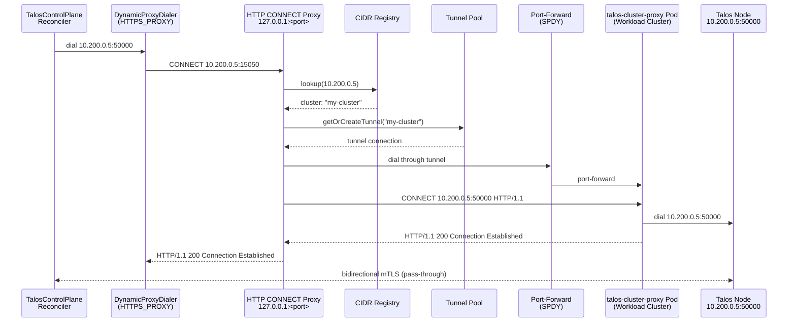

# Talos Proxy

When Kommodity manages clusters deployed on private networks, the TalosControlPlane reconciler cannot reach Talos nodes on their private IPs (port 50000). The Talos Proxy runs a local HTTP CONNECT proxy that intercepts these outbound gRPC connections and tunnels them through a Kubernetes port-forward to a `talos-cluster-proxy` pod running inside the workload cluster.

The Talos client library uses `DynamicProxyDialer` as its default gRPC dialer, which reads `HTTPS_PROXY` on every dial. By setting `HTTPS_PROXY=http://127.0.0.1:<port>`, all Talos client connections are routed through the local proxy with zero code changes to the external CAPI provider.

## Connection Flow



For non-matching traffic (API server, etc.), the proxy dials directly (passthrough) with minimal overhead.

## Package Structure

| File                 | Description                                                                                                                                                                                                               |
| -------------------- | ------------------------------------------------------------------------------------------------------------------------------------------------------------------------------------------------------------------------- |
| `proxy.go`           | Main `Proxy` struct. Implements `manager.Runnable` for lifecycle management. Two-phase startup: `Listen()` binds the TCP listener, `Start()` serves HTTP CONNECT requests.                                                |
| `connect_handler.go` | `ConnectHandler` implementing `http.Handler`. Handles CONNECT requests: CIDR-matching traffic is routed through tunnels, all other traffic passes through directly.                                                       |
| `env.go`             | `SetProxyEnv` function that configures `HTTPS_PROXY` and `NO_PROXY` environment variables.                                                                                                                                |
| `reconciler.go`      | Watches `Cluster` resources for the `kommodity.io/node-cidr` annotation. Registers/deregisters cluster CIDRs on change.                                                                                                   |
| `cidr_registry.go`   | Thread-safe mapping of `*net.IPNet` to cluster name/namespace. Routes connections to the correct tunnel.                                                                                                                  |
| `tunnel.go`          | Represents a single SPDY port-forward to a `talos-cluster-proxy` pod. Fetches the workload cluster kubeconfig from the `<cluster>-kubeconfig` Secret, discovers the proxy pod by label, and establishes the port-forward. |
| `tunnel_pool.go`     | Manages tunnels keyed by cluster name with double-checked locking. Creates tunnels on demand, closes idle tunnels after a configurable timeout, and removes stale ones on dial failure.                                   |
| `tracked_conn.go`    | `trackedConn` wrapper for `net.Conn` that decrements the tunnel's active connection count on close using `sync.Once`.                                                                                                     |
| `connection.go`      | `bidirectionalCopy` helper: copies data between two connections with half-close propagation.                                                                                                                              |
| `handshake.go`       | Performs the HTTP CONNECT handshake with the talos-cluster-proxy pod: sends `CONNECT <target> HTTP/1.1` and parses the response status line.                                                                              |
| `errors.go`          | Sentinel errors for the package.                                                                                                                                                                                          |

## Talos-Proxy CONNECT Protocol

The `talos-cluster-proxy` pod is an HTTP CONNECT proxy that forwards raw TCP connections to Talos nodes. It has no knowledge of node IPs or cluster topology, so the local proxy opens a CONNECT tunnel for each new connection:

```text
CONNECT 10.200.0.5:50000 HTTP/1.1\r\n
Host: 10.200.0.5:50000\r\n
\r\n
```

The pod replies with `HTTP/1.1 200 Connection Established\r\n\r\n` on success. After that, all subsequent bytes in both directions are forwarded verbatim between the local proxy and the Talos node — no additional framing is applied. A non-200 status indicates the pod rejected the request (for example, an unresolvable target or an unreachable node).

## Tunnel Lifecycle

1. On first connection to a cluster, `TunnelPool.GetOrCreateTunnel` creates a new `Tunnel`
2. The tunnel fetches the workload cluster kubeconfig from Secret `<cluster-name>-kubeconfig` in the `default` namespace
3. It discovers a running `talos-cluster-proxy` pod using the configured label selector (default: `app=talos-cluster-proxy`) in the configured namespace (default: `talos-cluster-proxy`)
4. A SPDY port-forward is established to the pod, with a system-assigned local port
5. Subsequent connections to the same cluster reuse the cached tunnel
6. Each connection is wrapped in a `trackedConn` that reference-counts active connections
7. When all connections are closed, an idle timer starts (default: 1m). If no new connections arrive, the tunnel is closed and removed
8. New requests arriving during the idle period cancel the timer and reuse the existing tunnel
9. On dial failure, the stale tunnel is removed and a fresh one is created on the next attempt
10. On cluster deregistration or proxy shutdown, tunnels and idle timers are closed

## Configuration

| Environment Variable                 | Description                                                       | Default                                      |
| ------------------------------------ | ----------------------------------------------------------------- | -------------------------------------------- |
| `KOMMODITY_TALOS_PROXY_ENABLED`      | Enable the HTTP CONNECT Talos gRPC proxy                          | `true`                                       |
| `KOMMODITY_TALOS_PROXY_PORT`         | Local listen port for the proxy                                   | `15050`                                      |
| `KOMMODITY_TALOS_PROXY_NAMESPACE`    | Namespace where talos-cluster-proxy pods run in workload clusters | `talos-cluster-proxy`                        |
| `KOMMODITY_TALOS_PROXY_LABEL`        | Label selector to find talos-cluster-proxy pods                   | `app.kubernetes.io/name=talos-cluster-proxy` |
| `KOMMODITY_TALOS_PROXY_POD_PORT`     | Port on the talos-cluster-proxy pod to forward to                 | `50000`                                      |
| `KOMMODITY_TALOS_PROXY_IDLE_TIMEOUT` | Idle timeout before closing unused tunnels (e.g., `1m`)           | `1m`                                         |

## Requirements

- **`talos-cluster-proxy` pod** running in the workload cluster ([repository](https://github.com/kommodity-io/talos-cluster-proxy)). It will be deployed by default by the `kommodity-cluster` Helm [chart](charts/kommodity-cluster).
- **Workload cluster kubeconfig** available as a `<cluster-name>-kubeconfig` Secret in the `default` namespace
- **`kommodity.io/node-cidr` annotation** on the `Cluster` resource with the node CIDR (e.g. `10.200.16.0/20`)

## Platform Support

The HTTP CONNECT proxy approach is fully platform-independent — it works on Linux, macOS, and any other platform that supports Go's `net/http`.

## Limitations

If `HTTPS_PROXY` environment variable is already set (e.g., corporate proxy), the value WON'T be overridden, and the Talos proxy will be disabled.
