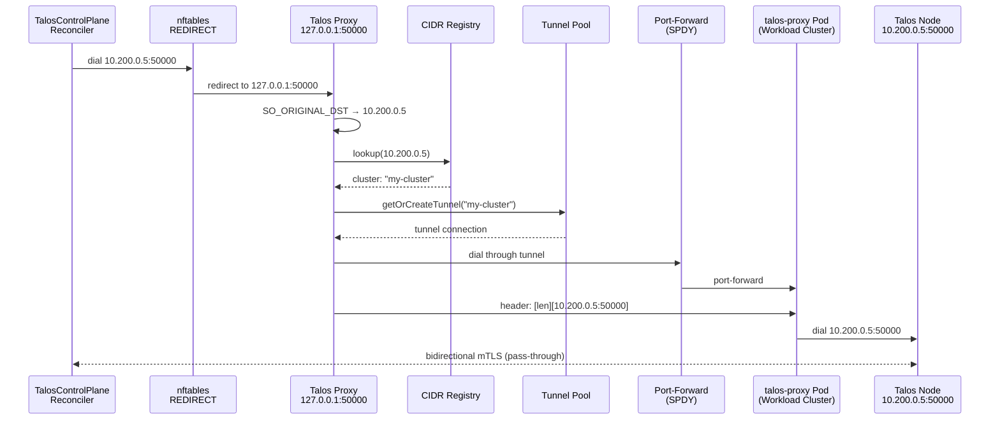

# Talos Proxy

When Kommodity manages clusters deployed on private networks, the TalosControlPlane reconciler cannot reach Talos nodes on their private IPs (port 50000). The Talos Proxy transparently intercepts these outbound gRPC connections and tunnels them through a Kubernetes port-forward to a `talos-proxy` pod running inside the workload cluster.

## Connection Flow



## Package Structure

| File | Description |
| --- | --- |
| `proxy.go` | Main `Proxy` struct. Implements `manager.Runnable` for lifecycle management with the controller manager. Listens on `127.0.0.1:<port>` and accepts intercepted connections. |
| `reconciler.go` | Watches `Cluster` resources for the `kommodity.io/node-cidr` annotation. Registers/deregisters cluster CIDRs and updates nftables rules on change. |
| `cidr_registry.go` | Thread-safe mapping of `*net.IPNet` to cluster name/namespace. Routes intercepted connections to the correct tunnel. |
| `tunnel.go` | Represents a single SPDY port-forward to a `talos-proxy` pod. Fetches the workload cluster kubeconfig from the `<cluster>-kubeconfig` Secret, discovers the proxy pod by label, and establishes the port-forward. |
| `tunnel_pool.go` | Manages tunnels keyed by cluster name with double-checked locking. Creates tunnels on demand and removes stale ones on dial failure. |
| `connection.go` | Per-connection handler: resolves original destination, dials tunnel, writes target address header, and performs bidirectional `io.Copy` with half-close propagation. |
| `header.go` | Writes the talos-proxy protocol header: 4-byte big-endian `uint32` length prefix followed by the target address string (e.g. `10.200.0.5:50000`). |
| `interceptor.go` | `Interceptor` interface with `UpdateRules` and `Cleanup` methods. |
| `interceptor_linux.go` | nftables implementation using `github.com/google/nftables` (pure Go, netlink-based). Creates a `kommodity-proxy` table with NAT output chain rules that redirect matching CIDR+port traffic to the local listener. |
| `interceptor_stub.go` | No-op stub for non-Linux platforms (macOS). Logs a warning and returns nil. |
| `origdst_linux.go` | Reads the original destination from a redirected socket via `getsockopt(fd, SOL_IP, SO_ORIGINAL_DST)` using `golang.org/x/sys/unix`. |
| `origdst_stub.go` | Returns `ErrOriginalDstNotAvailable` on non-Linux platforms. |
| `errors.go` | Sentinel errors: `ErrCIDRNotFound`, `ErrTunnelClosed`, `ErrProxyPodNotFound`, `ErrKubeconfigNotFound`, etc. |

## nftables Rules

For each registered CIDR, the interceptor creates a rule equivalent to:

```
table ip kommodity-proxy {
    chain output {
        type nat hook output priority -100; policy accept;
        ip daddr 10.200.16.0/20 tcp dport 50000 redirect to :50000
    }
}
```

Rules are rebuilt atomically on every cluster registration/deregistration by deleting the table and recreating it with the current set of CIDRs.

## Talos-Proxy Header Protocol

The `talos-proxy` pod expects a simple framing header before proxying:

```
[4 bytes: big-endian uint32 length][N bytes: target address string]
```

For example, to connect to `10.200.0.5:50000`, the proxy writes `0x00000012` (18 bytes) followed by the ASCII string `10.200.0.5:50000`. After the header, all subsequent bytes are forwarded to the target.

## Tunnel Lifecycle

1. On first connection to a cluster, `TunnelPool.GetOrCreateTunnel` creates a new `Tunnel`
2. The tunnel fetches the workload cluster kubeconfig from Secret `<cluster-name>-kubeconfig` in the `default` namespace
3. It discovers a running `talos-proxy` pod using the configured label selector (default: `app=talos-proxy`) in the configured namespace (default: `kube-system`)
4. A SPDY port-forward is established to the pod, with a system-assigned local port
5. Subsequent connections to the same cluster reuse the cached tunnel
6. On dial failure, the stale tunnel is removed and a fresh one is created on the next attempt
7. On cluster deregistration or proxy shutdown, tunnels are closed

## Configuration

| Environment Variable | Description | Default |
| --- | --- | --- |
| `KOMMODITY_TALOS_PROXY_ENABLED` | Enable the transparent Talos gRPC proxy | `true` |
| `KOMMODITY_TALOS_PROXY_PORT` | Local listen port for the proxy | `50000` |
| `KOMMODITY_TALOS_PROXY_NAMESPACE` | Namespace where talos-proxy pods run in workload clusters | `kube-system` |
| `KOMMODITY_TALOS_PROXY_LABEL` | Label selector to find talos-proxy pods | `app=talos-proxy` |
| `KOMMODITY_TALOS_PROXY_PROXY_PORT` | Port on the talos-proxy pod to forward to | `50000` |

## Requirements

- **`NET_ADMIN` capability** on the Kommodity container (for nftables rules)
- **Linux only** for traffic interception (no-op stub on macOS for development)
- **`talos-proxy` pod** running in the workload cluster ([repository](https://github.com/kommodity-io/talos-proxy))
- **Workload cluster kubeconfig** available as a `<cluster-name>-kubeconfig` Secret in the `default` namespace
- **`kommodity.io/node-cidr` annotation** on the `Cluster` resource with the node CIDR (e.g. `10.200.16.0/20`)
