# Talos Disk Encryption

Related ticket: [PLA-4577](https://linear.app/corti/issue/PLA-4577/enable-disk-encryption)

This document describes how we implement full disk encryption on Talos Linux nodes using LUKS2 and our [Kommodity](https://github.com/kommodity-io/kommodity/) KMS service.

## Overview

Talos Linux system volumes are encrypted at rest using LUKS2, with encryption keys managed by a network KMS (Key Management Service) hosted by Kommodity. Starting with **Talos v1.12**, all encrypted volumes are consistently mapped under `/dev/mapper/luks2-<volume-id>`.

### Encrypted Partitions

Two system partitions are mandatory to encrypt:

| Partition     | Device Mapper              | Contains                                       |
| ------------- | -------------------------- | ---------------------------------------------- |
| **STATE**     | `luks2-STATE` (`dm-1`)     | Kubernetes secrets, certificates, etcd data    |
| **EPHEMERAL** | `luks2-EPHEMERAL` (`dm-0`) | Container runtime data, emptyDir volumes, logs |

```
Physical disk:    sda (20 GB)
                   ├── sda1 (boot/EFI)
                   ├── sda2 → encrypted → luks2-STATE → dm-1
                   └── sda3 → encrypted → luks2-EPHEMERAL → dm-0
```

`dm-0` and `dm-1` are **device-mapper** devices — the decrypted view of the encrypted partitions. They are virtual devices that sit on top of the encrypted sda partitions.

> [!NOTE]
> For Ceph encryption in the future, Ceph's internal encryption capabilities can be used.

### Talos Encryption Methods

Talos Linux supports four encryption methods (can be combined per partition):

- **static** — Encrypt with a static passphrase (weakest; for STATE, the passphrase is stored in the META partition).
- **nodeID** — Key derived from the node UUID (weak; protects against data leaking from a removed drive).
- **kms** — Key sealed with a network KMS (strong; requires network access to decrypt). **This is what we use.**
- **tpm** — Key derived from the TPM (strong when combined with SecureBoot).

## Talos Machine Configuration

Disk encryption is configured in the Talos machine config under `machine.systemDiskEncryption`:

```yaml
machine:
  systemDiskEncryption:
    state:
      provider: luks2
      keys:
        - slot: 0
          kms:
            endpoint: https://kommodity
    ephemeral:
      provider: luks2
      keys:
        - slot: 0
          kms:
            endpoint: https://kommodity
```

### Important Caveat

When using KMS encryption for the **STATE** partition, network configuration **cannot** be provided via the machine configuration, because KMS requires network connectivity **before** the STATE partition is unlocked. Custom CA certificates also cannot be used for the KMS server since they are stored in the STATE partition.

## Kommodity KMS Service

[Kommodity](https://github.com/kommodity-io/kommodity/) implements the [SideroLabs KMS gRPC API](https://github.com/siderolabs/kms-client) (`sidero.kms.KMSService`). Talos nodes call this service during boot to seal and unseal their LUKS disk encryption keys.

The KMS service is hosted on a combined HTTP/gRPC server using [h2c](https://pkg.go.dev/golang.org/x/net/http2/h2c) (HTTP/2 cleartext). A single port routes requests by `Content-Type` header — `application/grpc` goes to the gRPC server, everything else to the HTTP mux.

### Client IP Extraction

The KMS binds encryption keys to the client's IP address. Because Talos nodes in private network clusters reach the KMS through a NAT gateway or reverse proxy, the server resolves the client IP using the following priority:

1. **`X-Forwarded-For`** header (leftmost entry) — injected by proxies/load balancers
2. **`X-Real-Ip`** header — injected by proxies
3. **`X-Envoy-External-Address`** header — injected by Envoy proxies
4. **gRPC peer address** (direct TCP) — fallback for direct connections

This ensures the correct client IP is used even when the KMS is behind a TLS-terminating reverse proxy or when nodes connect through a NAT gateway in private networks.

Implementation: [`pkg/kms/client_ip.go`](https://github.com/kommodity-io/kommodity/blob/main/pkg/kms/client_ip.go)

### Seal Flow (First Boot / Key Creation)

The [`Seal`](https://github.com/kommodity-io/kommodity/blob/main/pkg/kms/server.go) method encrypts a node's LUKS key. Talos calls Seal once per encrypted volume (STATE, EPHEMERAL), so a single node triggers two Seal RPCs.

1. The Talos node sends a `Seal` RPC with its `node_uuid` and plaintext LUKS key as `data`.
2. The server validates the `node_uuid` (must be a valid UUID) and that `data` is not empty.
3. The client IP is resolved (see [Client IP Extraction](#client-ip-extraction) above).
4. The server looks up a Kubernetes Secret named `talos-kms-<node-uuid>` in the `kommodity-system` namespace.
5. **If the secret does not exist** (first volume on first boot):
   - A random **volume prefix** is generated (8 random bytes → 16 hex chars) to isolate this volume's keys.
   - A **256-bit random AES key** is generated via `crypto/rand`.
   - A **256-bit random AAD nonce** is generated for this volume.
   - **AAD** (Additional Authenticated Data) is built from: `nodeUUID + aadNonce + clientIP`.
   - The LUKS key is encrypted using **AES-256-GCM** with the AAD.
   - A new Kubernetes Secret is created with the encrypted data, keys, and the client IP stored as `sealedFromIP`.
6. **If the secret already exists** (second volume, e.g. EPHEMERAL after STATE):
   - The stored `sealedFromIP` is compared to the current client IP. If they don't match, the request is rejected with `PermissionDenied`.
   - A new volume prefix, AES key, and AAD nonce are generated for this volume.
   - The new volume's key material is appended to the existing secret.
7. The encrypted blob (`nonce || ciphertext+tag`) is returned to the Talos node, which stores it on disk.

### Unseal Flow (Boot / Key Retrieval)

The [`Unseal`](https://github.com/kommodity-io/kommodity/blob/main/pkg/kms/server.go) method decrypts a node's LUKS key during boot:

1. The Talos node sends an `Unseal` RPC with its `node_uuid` and the previously sealed (encrypted) `data`.
2. The server validates the `node_uuid` and that `data` is not empty.
3. The client IP is resolved.
4. The stored `sealedFromIP` is compared to the current client IP. If they don't match, the request is rejected with `PermissionDenied`.
5. All volume key sets are parsed from the Kubernetes Secret.
6. For each volume key set, the server rebuilds the AAD (`nodeUUID + aadNonce + clientIP`) and attempts decryption.
7. The first successful decryption returns the plaintext LUKS key. If no key set can decrypt the data, the request fails.

### Additional Authenticated Data (AAD)

AES-256-GCM supports [Additional Authenticated Data](https://support.microchip.com/s/article/What-is-AAD--Additional-Authentication-Data--in-encryption) (AAD), which is authenticated but not encrypted. During decryption, the same AAD must be provided or the operation fails — this cryptographically binds the ciphertext to its context.

The AAD is built by concatenating three components:

```
AAD = nodeUUID || aadNonce || clientIP
```

| Component  | Size     | Purpose                                                                                      |
| ---------- | -------- | -------------------------------------------------------------------------------------------- |
| `nodeUUID` | variable | Binds the key to a specific node                                                             |
| `aadNonce` | 32 bytes | Per-volume random value — ensures each volume has a unique AAD even for the same node and IP |
| `clientIP` | variable | Binds the key to the node's network identity                                                 |

This provides defense-in-depth: even if an attacker obtains the encrypted LUKS key blob from disk, they cannot decrypt it without the correct AES key **and** the correct AAD context (node UUID, nonce, and IP).

> [!NOTE]
> The GCM nonce (12 bytes, used for the AES-GCM encryption itself) is separate from the AAD nonce (32 bytes, used as part of the AAD). The 12-byte GCM nonce size is the standard recommended by [NIST SP 800-38D](https://csrc.nist.gov/publications/detail/sp/800-38d/final).

Implementation: [`pkg/kms/crypto.go`](https://github.com/kommodity-io/kommodity/blob/main/pkg/kms/crypto.go)

### Key Storage

Per-node encryption keys are stored as Kubernetes Secrets in the `kommodity-system` namespace. Each node has a single secret that holds key material for all its encrypted volumes.

- **Secret name**: `talos-kms-<node-uuid>`
- **Labels**:
  - `app.kubernetes.io/managed-by: kommodity`
  - `talos.dev/node-uuid: <uuid>`
  - `talos.dev/node-ip: <ip>`

**Secret data structure** (one entry set per volume, prefixed for isolation):

| Key                | Value                                                     |
| ------------------ | --------------------------------------------------------- |
| `sealedFromIP`     | Client IP that created the secret (used for verification) |
| `<prefix>.key`     | 256-bit AES encryption key for this volume                |
| `<prefix>.nonce`   | 256-bit random AAD nonce for this volume                  |
| `<prefix>.luksKey` | AES-256-GCM encrypted LUKS key for this volume            |

Each volume gets a unique random prefix (16 hex chars). A node with two encrypted volumes (STATE + EPHEMERAL) will have two sets of `<prefix>.{key,nonce,luksKey}` entries in the same secret.

Labels are defined in [`pkg/config/const.go`](https://github.com/kommodity-io/kommodity/blob/main/pkg/config/const.go).

## Validation and Testing

### Test 1: Initial Cluster Deployment

A test cluster was deployed with disk encryption enabled on both control-plane and worker nodes.

After bootstrap, `kubectl get nodes` confirms both nodes are `Ready`:

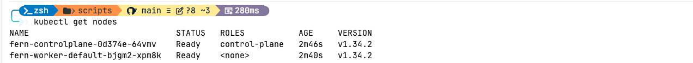

All system pods are running:

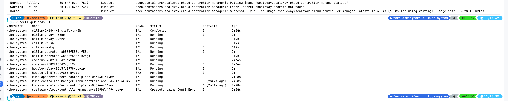

### Verifying Encryption in Machine Config

The machine config on both control-plane and worker nodes shows LUKS2 encryption configured for STATE and EPHEMERAL volumes with the Kommodity KMS endpoint:

**Control-plane node:**

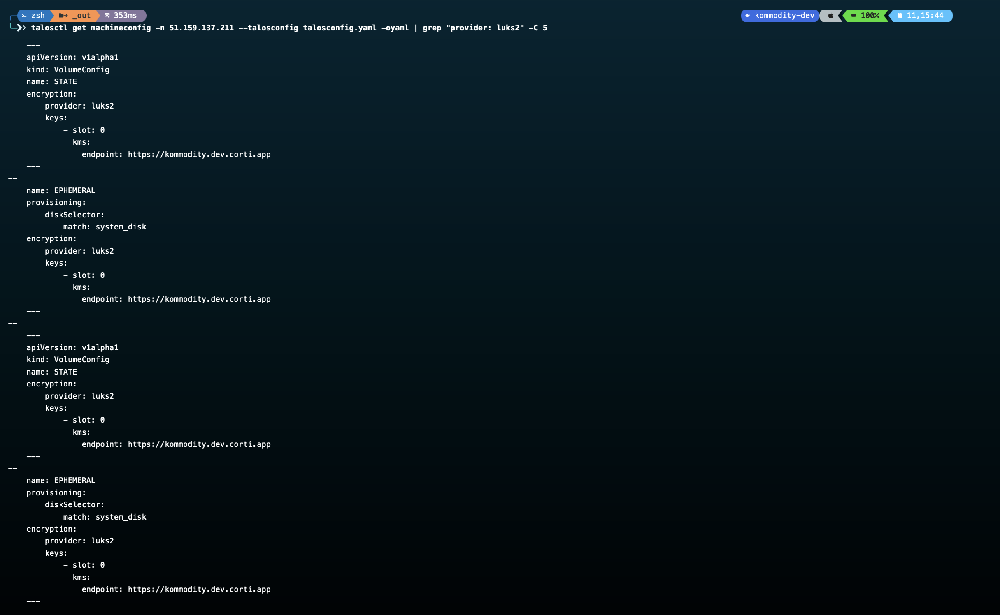

**Worker node:**

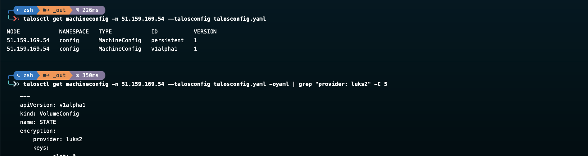

### Verifying Device Mapper

Listing `/dev/mapper` on a node confirms the LUKS2 encrypted devices are active:

```
talosctl --talosconfig talosconfig.yaml ls /dev/mapper -n <node-ip>
```

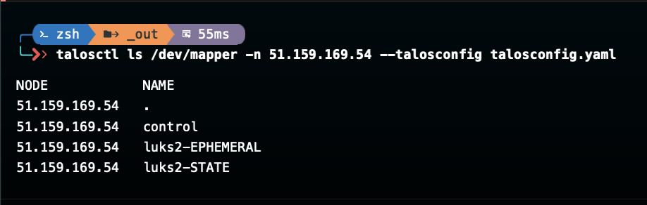

### Verifying Disk Layout

```
talosctl --talosconfig ./talosconfig.yaml get disks --nodes <node-ip>
```

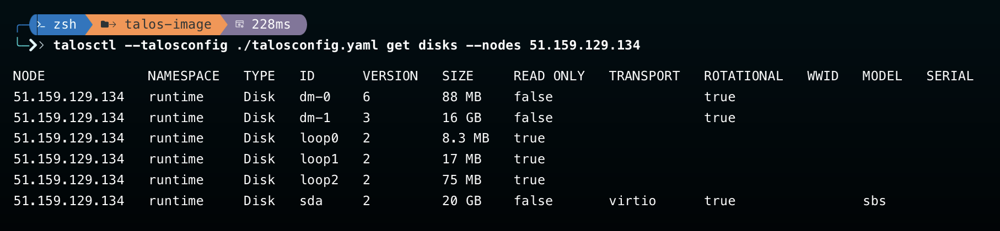

The `dm-0` and `dm-1` device-mapper devices represent the decrypted views of the encrypted partitions.

### Encryption Proof in Logs

Talos boot logs show `opening encrypted volume` for the STATE partition during boot:

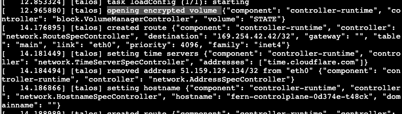

### Test 2: Reboot Resilience

VMs were rebooted from the Scaleway dashboard to verify that encrypted nodes can successfully boot back up by reaching the KMS to unseal their keys.

**Worker node after reboot** — all pods rescheduled and running:

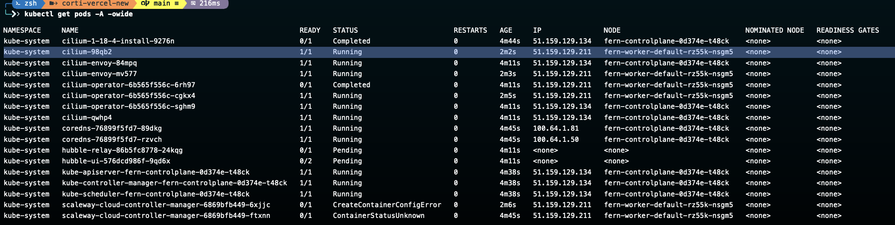

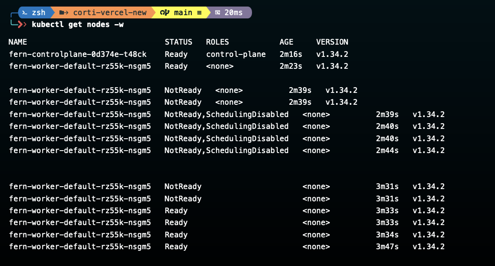

**Control-plane node after reboot** — boot logs show successful startup with encryption:

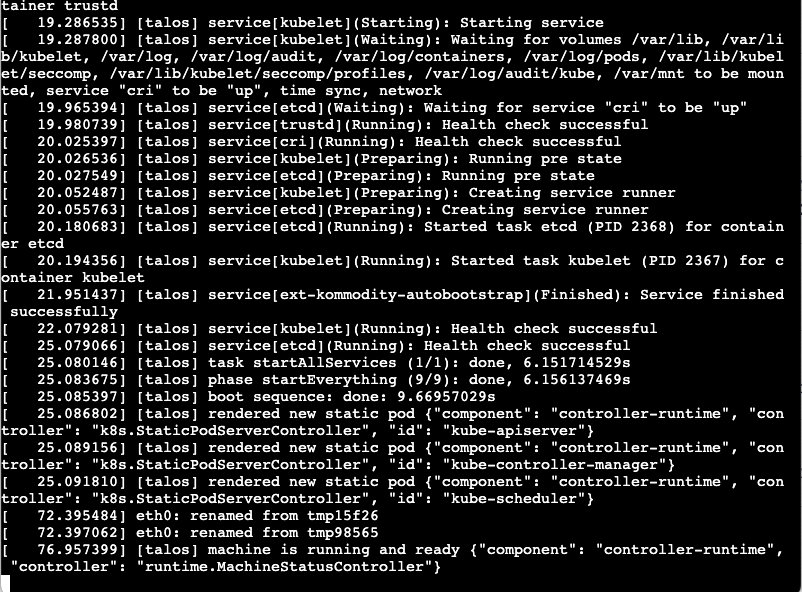

### Talosctl Dashboard

Cluster health can be verified via the dashboard:

```
talosctl --talosconfig ./talosconfig.yaml dashboard --nodes <control-plane-ip>
```

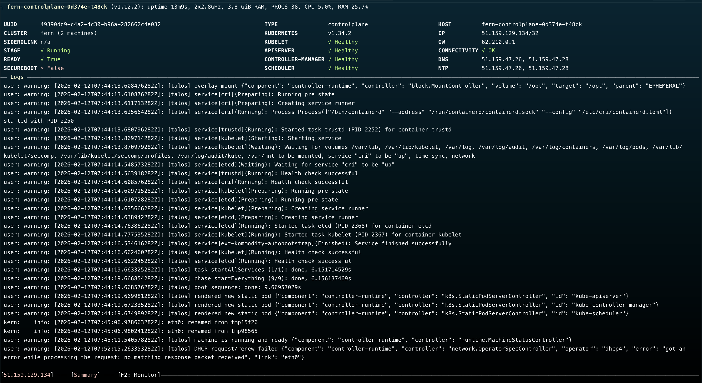

### Test 3: Physical Disk Extraction Simulation

To validate that encryption actually protects data at rest, the Talos node's disk was detached and attached to a separate VM in Scaleway.

**Step 1**: Create a new VM and attach the Talos volume:

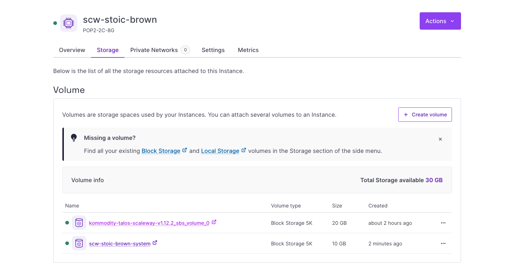

**Step 2**: SSH into the new VM and verify the disk is attached via `lsblk`:

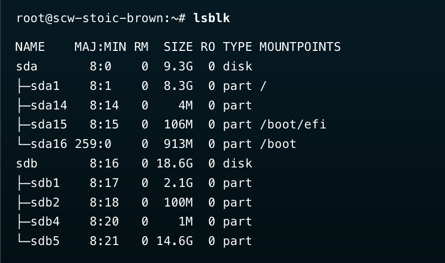

**Step 3**: The boot partition (`sdb1`) is **readable** as expected — it only contains EFI/bootloader files:

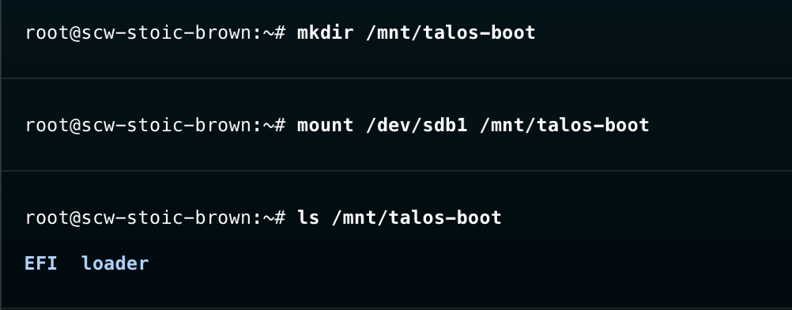

**Step 4**: Attempting to mount the STATE partition (`sdb2`) **fails** with `unknown filesystem type 'crypto_LUKS'`:

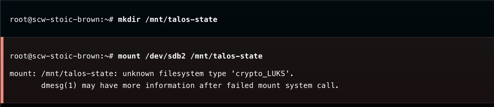

**Step 5**: Same for the EPHEMERAL partition (`sdb5`) — also **encrypted and unreadable**:

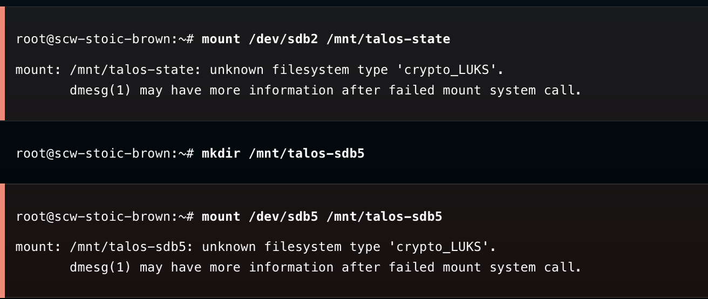

This confirms that both STATE and EPHEMERAL partitions are properly encrypted and cannot be read without the KMS-managed encryption keys.

## Useful Commands

```bash
# Check cluster health
talosctl --talosconfig ./talosconfig.yaml health --nodes <control-plane-ip>

# Open the Talos dashboard
talosctl --talosconfig ./talosconfig.yaml dashboard --nodes <control-plane-ip>

# Get disk information
talosctl --talosconfig ./talosconfig.yaml get disks --nodes <node-ip>

# List device mapper entries (verify luks2 devices)
talosctl --talosconfig ./talosconfig.yaml ls /dev/mapper -n <node-ip>

# Get machine config and check encryption settings
talosctl --talosconfig ./talosconfig.yaml get machineconfig -n <node-ip> -oyaml | grep "provider: luks2" -C 5
```

### Using talosctl in a Downstream Cluster

If you need to run `talosctl` commands against nodes in a downstream (workload) cluster but don't have direct access, use the [`create-talosctl-debug-pod.sh`](https://github.com/kommodity-io/kommodity/blob/main/scripts/create-talosctl-debug-pod.sh) script from the Kommodity repository. It creates a debug pod inside the downstream cluster with `talosctl` pre-installed and the talosconfig mounted from the upstream (Kommodity management) cluster.

```bash
./scripts/create-talosctl-debug-pod.sh <upstream-context> <downstream-context> <cluster-name>
```

The script:

1. Extracts the `talosconfig` from the `<cluster-name>-talosconfig` secret in the upstream cluster.
2. Creates a secret and a debug pod in the downstream cluster with `talosctl` downloaded and ready.
3. Prints instructions for attaching to the pod and running commands.

Once the pod is ready, you can exec into it and run any `talosctl` command:

```bash
kubectl --context <downstream-context> exec -it <cluster-name>-talosctl-debug -- talosctl get members --nodes <node-ip>
```

## References

- [Talos Linux Disk Encryption Documentation](https://docs.siderolabs.com/talos/v1.12/configure-your-talos-cluster/storage-and-disk-management/disk-encryption)
- [Kommodity KMS Implementation](https://github.com/kommodity-io/kommodity/blob/main/pkg/kms/server.go)
- [Kommodity Client IP Extraction](https://github.com/kommodity-io/kommodity/blob/main/pkg/kms/client_ip.go)
- [Kommodity Crypto (AES-256-GCM with AAD)](https://github.com/kommodity-io/kommodity/blob/main/pkg/kms/crypto.go)
- [SideroLabs KMS Client API](https://github.com/siderolabs/kms-client)
- [NIST SP 800-38D — GCM Specification](https://csrc.nist.gov/publications/detail/sp/800-38d/final)
- [AAD (Additional Authenticated Data) Explained](https://support.microchip.com/s/article/What-is-AAD--Additional-Authentication-Data--in-encryption)
