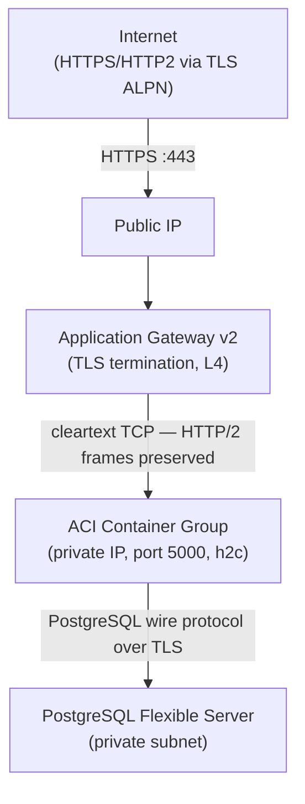

# Kommodity Azure Deployment (ACI)

Terraform module that deploys Kommodity on **Azure Container Instances (ACI)** with an **Application Gateway v2** for TLS termination and HTTP/2 support.

## Architecture



## Why ACI instead of Container Apps?

Azure Container Apps does not support end-to-end HTTP/2 in all scenarios. This module uses ACI with Application Gateway v2 to ensure gRPC/kubectl traffic flows correctly through the public endpoint via TLS ALPN negotiation.

## Usage

```hcl
module "kommodity" {
  source = "../kommodity_azure_deployment_aci"

  resource_group = {
    name     = "my-kommodity"
    location = "North Europe"
  }

  key_vault = {
    name = "my-kommodity-kv"
  }

  oidc_configuration = {
    issuer_url  = "https://login.microsoftonline.com/<tenant>/v2.0"
    client_id   = "<client-id>"
    admin_group = "<group-id>"
  }
}
```

## Inputs

| Variable              | Type   | Required | Description                                               |
| --------------------- | ------ | -------- | --------------------------------------------------------- |
| `resource_group`      | object | Yes      | Resource group name and location                          |
| `key_vault`           | object | Yes      | Key Vault name (must be globally unique) and optional SKU |
| `oidc_configuration`  | object | Yes      | OIDC issuer URL, client ID, admin group                   |
| `virtual_network`     | object | No       | VNET and subnet CIDR configuration                        |
| `database`            | object | No       | PostgreSQL configuration                                  |
| `database_password`   | object | No       | Password generation settings                              |
| `log_analytics`       | object | No       | Log Analytics workspace settings                          |
| `application_gateway` | object | No       | App Gateway SKU and capacity                              |
| `kommodity_container` | object | No       | Container image, resources, and app settings              |

## Outputs

| Output                   | Description                             |
| ------------------------ | --------------------------------------- |
| `app_url`                | Public HTTPS endpoint                   |
| `appgw_public_ip`        | Public IP address (for DNS)             |
| `aci_private_ip`         | ACI private IP (for direct VNET access) |
| `application_gateway_id` | Application Gateway resource ID         |

## Notes

- **ACI private IP is dynamic** — it changes on container group restart. Run `terraform apply` to update the App Gateway backend pool after ACI restarts.
- **TLS certificate** is self-signed and auto-renewed by Azure Key Vault. Replace with a CA-signed certificate for production use.
- **Key Vault name** must be globally unique across Azure.
